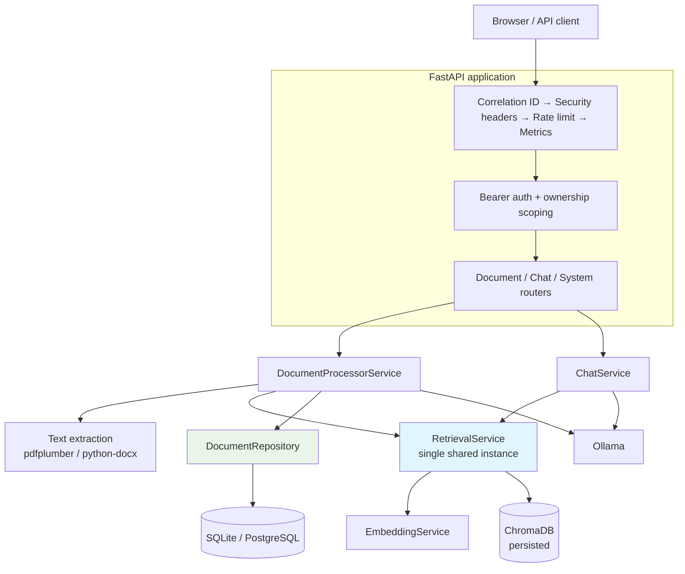

# Roneira  Document Intelligence

Upload documents, ask questions about them, and get answers with citations
back to the exact page they came from.

[](https://github.com/aaron-seq/Roneira-AI-LLM-powered-document-intelligence-system/actions/workflows/ci.yml)
[](https://www.python.org/downloads/release/python-3110/)
[](LICENSE)

Runs entirely on your own machine. No API keys, no data leaving the host.

---

## What it does

You point it at a pile of PDFs, Word documents, scans or text files. It
extracts the text, splits it into passages, indexes them, and then answers
questions against **only those documents**  telling you which file and page
each part of the answer came from.

**It is built for the case where being wrong is expensive.** Three properties
follow from that:

- **Every answer is attributable.** Each citation carries a document, a page
  and a similarity score. The original file is retained and downloadable, so
  you can open page 7 and check.
- **It says when it does not know.** If retrieval finds nothing above the
  relevance threshold, the answer says so instead of quietly falling back to
  the model's general knowledge next to an empty source list.
- **It tells you when it is degraded.** If no embedding model is loaded,
  search drops to keyword matching  and `/api/health`, `/api/rag/stats`,
  every chat response and a Prometheus gauge all report it.

### What it is not

Being clear about this saves you an evaluation:

- Not a hosted product. There is no multi-tenant billing, SSO, or audit log.
- The bundled `demo`/`admin` accounts are **development conveniences**, not a
  user management system. See [docs/SECURITY.md](docs/SECURITY.md) before
  putting real documents in it.
- OCR reads scanned PDFs and image uploads, but it needs the tesseract binary
  installed (see [below](#reading-scanned-documents)). Without it a scan is
  refused with that reason rather than silently indexed as empty.

---

## Quick start

**Prerequisites:** Python 3.11+, and [Ollama](https://ollama.com) if you want
generated summaries and chat answers.

```bash
git clone https://github.com/aaron-seq/Roneira-AI-LLM-powered-document-intelligence-system.git
cd Roneira-AI-LLM-powered-document-intelligence-system

python -m venv .venv && source .venv/bin/activate   # Windows: .venv\Scripts\activate
pip install -r requirements.txt

cp .env.example .env
uvicorn backend.main:app --reload
```

Open <http://localhost:8000/api/docs>.

Nothing else is required. There is no database to provision  SQLite and an
on-disk vector store are created on first run.

### Try it in 60 seconds

```bash
# 1. Get a token (built-in development account)
TOKEN=$(curl -s -X POST http://localhost:8000/api/auth/token \
  -d "username=demo&password=demo" | python -c "import sys,json; print(json.load(sys.stdin)['access_token'])")

# 2. Upload one of the sample documents bundled in docs/
DOC=$(curl -s -X POST http://localhost:8000/api/documents/upload \
  -H "Authorization: Bearer $TOKEN" \
  -F "file=@docs/samples/INV-2025-1001.pdf" | python -c "import sys,json; print(json.load(sys.stdin)['document_id'])")

# 3. Watch it process
curl -s "http://localhost:8000/api/documents/$DOC/status" -H "Authorization: Bearer $TOKEN"

# 4. Search it
curl -s -X POST http://localhost:8000/api/search \
  -H "Authorization: Bearer $TOKEN" -H "Content-Type: application/json" \
  -d '{"query":"total amount due","top_k":3}'

# 5. Ask a question
curl -s -X POST http://localhost:8000/api/chat \
  -H "Authorization: Bearer $TOKEN" -H "Content-Type: application/json" \
  -d '{"message":"What is the invoice total and who is it billed to?"}'
```

### Or load the whole sample corpus at once

```bash
python scripts/load_samples.py
```

The repository ships **22 sample documents** in
[`docs/samples/`](docs/samples/)  ten invoices, ten HR policies and two
long-form text files, all synthetic. The loader uploads them, waits for
indexing, and tells you how many searchable chunks resulted.
[`docs/samples/README.md`](docs/samples/README.md) lists questions worth
asking of each set.

### Turning on semantic search

Out of the box, search matches **keywords**. To match meaning  so "how much do
we owe?" finds "total amount due"  install the embedding model:

```bash
pip install sentence-transformers
```

The first run downloads ~90MB. To make the service refuse to start rather than
silently fall back, set `REQUIRE_REAL_EMBEDDINGS=true`.

The same package supplies the cross-encoder used to rerank results, which is
the single largest accuracy gain available here — recall@1 goes from 69% to
77% and recall@3 from 92% to 100% on the bundled corpus. To see that on your
own machine:

```bash
python scripts/eval_retrieval.py --compare
```

### Reading scanned documents

Scanned PDFs and image uploads (`.png`, `.jpg`, `.tiff`) are read with OCR.
The Python side installs with everything else; the OCR engine itself is a
system package:

```bash
# macOS
brew install tesseract
# Debian / Ubuntu
sudo apt-get install tesseract-ocr
# Windows
winget install UB-Mannheim.TesseractOCR
```

Then check it was found:

```bash
python -c "from backend.common.ocr import ocr_availability; print(ocr_availability())"
# (True, 'tesseract 5.4.0')
```

If the binary is somewhere unusual, point `TESSERACT_PATH` at it. Set
`ENABLE_OCR=false` to switch OCR off entirely.

**What it does.** Only pages that have no text layer are OCR'd, so a normal
PDF costs nothing extra and a half-scanned one only pays for the scanned
pages. OCR'd pages keep their page markers, so they cite like any other page.
The document records which pages were machine-read in `ocr_pages`.

**What it does not do.** No deskewing, denoising or handwriting support, and
at most 50 pages per document. A poor scan gives poor text — and because that
text is what gets indexed and cited, check `ocr_pages` before trusting an
answer drawn from one.

### Turning on summaries and chat

```bash
ollama pull llama3.2:3b
ollama serve
```

Without Ollama the service still extracts, indexes and searches documents; it
just cannot summarise them or answer in prose. `/api/health` will report
`degraded` with the reason.

### With Docker

```bash
cp .env.example .env
docker compose up

# with Prometheus and Grafana:
docker compose --profile observability up
```

| Service | URL |
|---|---|
| API | <http://localhost:8000/api/docs> |
| Frontend | <http://localhost:3000> |
| Grafana | <http://localhost:3001> (admin/admin) |
| Prometheus | <http://localhost:9090> |

### Frontend

```bash
npm install
npm run dev        # http://localhost:3000, proxies /api to the backend
```

---

## API

Full interactive reference at `/api/docs`. The endpoints you will actually use:

| Method | Path | Purpose |
|---|---|---|
| `POST` | `/api/auth/token` | Exchange credentials for a bearer token |
| `GET` | `/api/auth/me` | Check who the current token belongs to |
| `POST` | `/api/documents/upload` | Upload a document (202, processed in background) |
| `GET` | `/api/documents` | List your documents, paginated |
| `GET` | `/api/documents/{document_id}/status` | Processing progress |
| `GET` | `/api/documents/{document_id}` | Extracted text, metadata and AI analysis |
| `GET` | `/api/documents/{document_id}/source` | Download the original file |
| `GET` | `/api/documents/compare?left=…&right=…` | What changed between two documents (`&fmt=markdown` to download) |
| `GET` | `/api/documents/{document_id}/export` | Summary, details and text as Markdown |
| `DELETE` | `/api/documents/{document_id}` | Delete the document, its chunks and its vectors |
| `POST` | `/api/search` | Semantic/keyword search with citations |
| `POST` | `/api/chat` | Grounded question answering |
| `GET` | `/api/rag/stats` | Index size and embedding backend |
| `POST` | `/api/feedback` | Rate an answer |
| `GET` | `/api/health` | Component-level health |
| `GET` | `/api/metrics` | Prometheus metrics |

Every document endpoint is scoped to the authenticated caller. A document
belonging to another user returns `404`, not `403`  its existence is not
confirmed either way.

### Reading a chat response

```jsonc
{
  "message": "The invoice total is $12,480.00, billed to Contoso Ltd.",
  "session_id": "5f2a…",
  "grounded": true,              // the answer text was built from the passages below
  "embeddings_are_real": true,   // false means keyword-only matching
  "sources": [
    {
      "document_id": "8c1e…",
      "chunk_id": "8c1e…_chunk_3",
      "filename": "INV-2025-1001.pdf",
      "page_number": 1,          // open this page to verify
      "score": 0.82,
      "content_preview": "Total amount due: $12,480.00 …"
    }
  ]
}
```

`grounded: false` means the answer is **not** supported by your documents —
either retrieval found nothing above the threshold, or the language model was
unavailable so no answer could be composed at all. In the second case the
retrieved passages are still returned in `sources`, so you can read them
yourself; they are simply not presented as a cited answer.

---

## Configuration

Every variable is read by `backend/core/config.py`; anything not defined there
has no effect. See [`.env.example`](.env.example) for the annotated list. The
ones that change behaviour most:

| Variable | Default | Why you would change it |
|---|---|---|
| `ENVIRONMENT` | `development` | `production` enables startup checks that refuse unsafe config |
| `SECRET_KEY` | placeholder | **Must** be changed for production; ≥32 chars |
| `REQUIRE_AUTHENTICATION` | `true` | `false` opens every endpoint  local experiments only |
| `REQUIRE_REAL_EMBEDDINGS` | `false` | `true` fails startup rather than degrading to keyword search |
| `RETAIN_SOURCE_FILES` | `true` | `false` where documents must not be kept at rest |
| `SOURCE_RETENTION_DAYS` | `30` | How long retained originals live |
| `CHUNK_SIZE` / `CHUNK_OVERLAP` | `1000` / `200` | Retrieval granularity |
| `RETRIEVAL_MIN_SCORE` | `0.15` | Raise to cut weak citations, lower to widen recall |
| `HYBRID_RETRIEVAL` | `true` | `false` ranks by meaning alone, ignoring keyword overlap |
| `RERANK_RESULTS` | `true` | Cross-encoder reranking. Measured: recall@1 69% → 77%. Costs an ~80MB download and ~100ms/query |
| `ENABLE_OCR` / `TESSERACT_PATH` | `true` / auto | Read scanned pages; point at the binary if it is not on `PATH` |
| `DATABASE_URL` | SQLite | PostgreSQL is required for more than one worker |

Setting `ENVIRONMENT=production` makes the service **refuse to start** with a
placeholder secret key, authentication disabled, wildcard CORS, or debug on.
That is deliberate: those are configuration mistakes you want to discover at
deploy time, not from an incident.

---

## Architecture


```mermaid
graph TB
    Client[Browser / API client] --> MW

    subgraph API["FastAPI application"]
        MW[Correlation ID → Security headers → Rate limit → Metrics]
        MW --> Auth[Bearer auth + ownership scoping]
        Auth --> Routers[Document / Chat / System routers]
    end

    Routers --> Processor[DocumentProcessorService]
    Routers --> Chat[ChatService]

    Processor --> Extract[Text extraction<br/>pdfplumber / python-docx]
    Processor --> Retrieval
    Chat --> Retrieval

    Retrieval[RetrievalService<br/>single shared instance] --> Embed[EmbeddingService]
    Retrieval --> Vectors[(ChromaDB<br/>persisted)]

    Processor --> Repo[DocumentRepository]
    Chat --> LLM[Ollama]
    Processor --> LLM

    Repo --> DB[(SQLite / PostgreSQL)]

    style Retrieval fill:#e1f5fe
    style Repo fill:#e8f5e8
```

The single most important edge is that **one** `RetrievalService` is shared by
document processing and chat. When each constructed its own, uploads went into
one vector store and questions searched a different, empty one.

Deeper detail  data model, request flow, failure modes and the list of
modules that are present but not wired in  is in
[docs/ARCHITECTURE.md](docs/ARCHITECTURE.md).

---

## Development

```bash
pytest                              # 245 tests, 70% coverage gate
pytest backend/tests/test_auth.py   # one file
pytest tests/ --no-cov              # 130 tests for the src/ research modules
ruff check backend/ && ruff format backend/
mypy backend/core backend/api backend/repositories --ignore-missing-imports

npm run type-check && npm run lint && npm run build
```

CI runs all of the above plus a smoke job that boots the application and
drives a document from upload through to a successful search  the check that
would have caught the import error which made the service unstartable.

Dependencies are installed on Python 3.11, 3.12 and 3.13 in CI. That matrix
exists because "Python 3.11+" was claimed but untrue: two pinned packages had
no 3.13 wheels, so `pip install -r requirements.txt` failed outright on a
current interpreter and nothing in CI noticed.

Contribution guidelines: [CONTRIBUTING.md](CONTRIBUTING.md).

---

## Troubleshooting

Failure modes that have actually happened here, and what each one means.

| Symptom | Cause | Fix |
|---|---|---|
| `ModuleNotFoundError: No module named 'backend'` from `pytest` | The repository root is not on `sys.path`. `python -m pytest` adds it, a bare `pytest` does not | `pytest.ini` sets `pythonpath = .`; if you removed it, run `python -m pytest` |
| `ruff check` fails with `Unknown rule selector: ASYNC240` | Your ruff is older than the pinned one | `pip install -r requirements.txt` (ruff is pinned there) |
| Chat answers say the model is not running | Ollama is not reachable | `ollama serve`, or accept degraded mode — extraction, indexing and search still work |
| Every answer has `embeddings_are_real: false` | `sentence-transformers` is not installed, so search is keyword-only | `pip install sentence-transformers` |
| Service refuses to start naming `SECRET_KEY`/`ALLOWED_HOSTS` | `ENVIRONMENT=production` with unsafe config | That check is deliberate — fix the config, do not set `ENVIRONMENT=development` |
| A scanned PDF is rejected naming OCR | The tesseract binary is not installed | See [Reading scanned documents](#reading-scanned-documents) |
| A scan is indexed but the text is garbled | OCR quality is limited by the scan | Check `ocr_pages` on the document; there is no deskew/denoise pass |
| Windows: `PermissionError: [WinError 32]` tearing down tests | ChromaDB holds `chroma.sqlite3` open; the temp dir cannot be unlinked | Already ignored in `conftest.py`; it is a teardown artefact, not a test failure |
| `AttributeError: np.float_ was removed in the NumPy 2.0 release` on startup | An older environment resolved NumPy 2 alongside chromadb 0.5, which uses `np.float_` | `pip install -r requirements.txt` — both are pinned together now |
| `sqlite3.OperationalError: table documents already exists` on startup | Several Gunicorn workers created the schema at once | Fixed: the losing worker rechecks and continues. If you see it again, the database is genuinely unreachable |
| Container exits during startup under Gunicorn | Multiple workers on SQLite, which is single-writer | `WORKERS` now defaults to 1 for SQLite; raise it only with `DATABASE_URL` on PostgreSQL |
| Windows: Python crashes under Git Bash with `TP_NUM_C_BUFS too small` | A Cygwin/MSYS limitation, not a project bug | Run Python, `pytest` and `uvicorn` from PowerShell or `cmd` |
| Frontend loads a different app on `localhost:3000` | Another process owns IPv6 `::1:3000`; Vite binds IPv4 | Use `http://127.0.0.1:3000`, or free the port |

---

## Roadmap

Ordered by how much each would improve the product for a real user.

### Next

- **Table extraction.** `extract_tables` is accepted as an upload option and
  currently ignored; invoices and reports are mostly tables.
- **Structured field extraction.** Pull invoice number, totals, dates and
  parties into typed fields rather than prose, so results can be exported.
- **Streaming chat responses.** `stream_chat` fakes streaming by chunking a
  finished answer; wire it to Ollama's streaming endpoint.

### After that

- **Collections and tags.** Blocked on something structural rather than
  difficult: the schema is created with `create_all` and there is no
  migrations directory, so a new column reaches a fresh database and never an
  existing one. Adding Alembic is the prerequisite, not the tagging UI.

- **Redaction before indexing.** PII is already detected on every upload and
  reported on the document; the option to redact it *before* the text is
  chunked and embedded is what would make this deployable in regulated
  settings.
- **A real user store.** Registration, password reset, and roles backed by
  the database rather than a dict.

### Longer term

- Multi-tenant workspaces with shared document collections.
- A retrieval evaluation harness with a labelled question set, so changes to
  chunking or embeddings can be measured rather than guessed at.
- Webhooks and an async job queue (Celery/arq) so processing survives a
  restart mid-document.
- Connectors: S3, Google Drive, SharePoint, email.

Known limitations are listed honestly in
[docs/ARCHITECTURE.md](docs/ARCHITECTURE.md#known-limitations).

---

## Documentation

| Document | Contents |
|---|---|
| [docs/ARCHITECTURE.md](docs/ARCHITECTURE.md) | Request flow, data model, failure modes, unwired modules |
| [docs/SECURITY.md](docs/SECURITY.md) | Threat model, what to change before real data, reporting |
| [docs/DEPLOYMENT.md](docs/DEPLOYMENT.md) | Production checklist, scaling, backups |
| [docs/OLLAMA_SETUP.md](docs/OLLAMA_SETUP.md) | Installing the local LLM, per platform |
| [docs/samples/README.md](docs/samples/README.md) | The demo corpus and what to ask it |
| [CONTRIBUTING.md](CONTRIBUTING.md) | Setup, conventions, review expectations |

---

## License

MIT  see [LICENSE](LICENSE).

Built by [Aaron Sequeira](https://github.com/aaron-seq).
