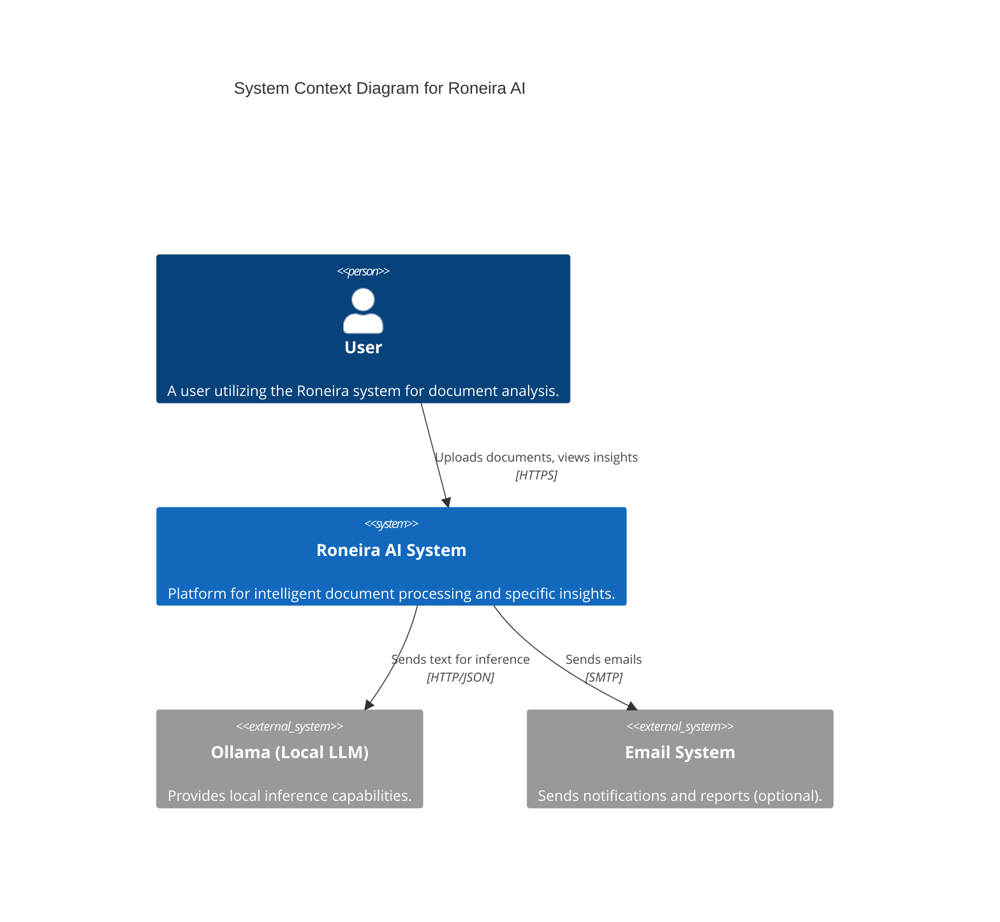
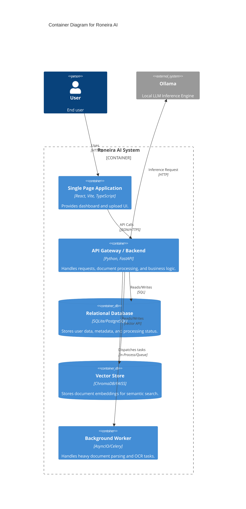
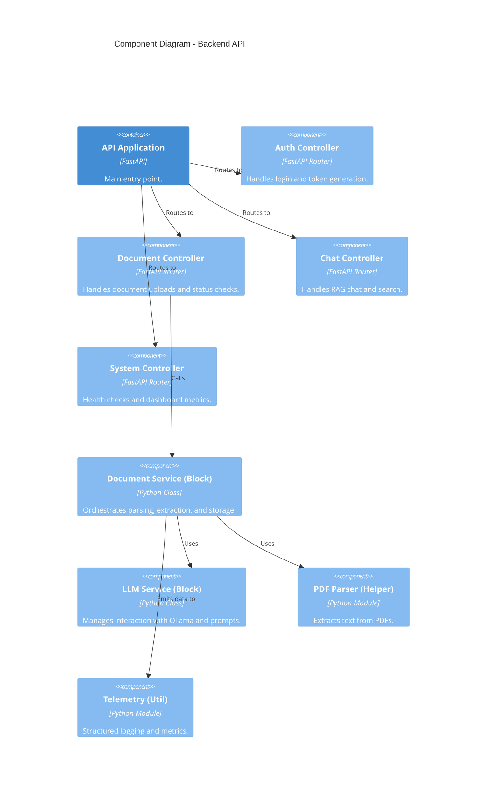

# System Architecture

## Overview

This document outlines the architectural design of the Roneira Document Intelligence System, following the C4 Model (Context, Containers, Components).

## 1. System Context (Level 1)

High-level view of how the system interacts with users and external systems.



## 2. Container Diagram (Level 2)

The high-level technical building blocks.



## 3. Component Diagram (Level 3) - Backend API

Drilling down into the FastAPI Backend structure.



## 4. Code Concepts & Directory Structure

To maintain scalability and developer velocity, we strictly follow the **Block / Helpers / Utils** pattern.

### 4.1 Block (Business Logic)

**Location**: `backend/services/`

- Contains the core _domain logic_ of the application.
- Orchestrates data flow between controllers, data access, and external services.
- **Rules**:
  - Pure Python.
  - No direct HTTP/API framework dependencies (agnostic).
  - Must emit telemetry.

### 4.2 Helpers (Project Utilities)

**Location**: `backend/models/` or `backend/helpers/`

- Domain-specific utilities that are reused across blocks but are tied to _this specific project_.
- Examples: `PDFParser`, `CostCalculator`, `PermissionChecker`.

### 4.3 Utils (Shared Utilities)

**Location**: `backend/utils/`

- Generic, pure functions that could theoretically be packaged as a separate library.
- Examples: `format_date`, `generate_uuid`, `encrypt_string`.
- **Rules**:
  - No dependencies on project business logic.
  - Side-effect free where possible.

### 4.4 Structure Map

```text
backend/
├── main.py                 # Entry point
├── api/                    # Controllers (Routes)
│   └── routers/            # Route Handlers
│       ├── auth.py
│       ├── chat.py
│       └── ...
├── services/               # BLOCKS (Business Logic)
│   ├── document_service.py
│   └── local_llm_service.py
├── common/                 # HELPERS & UTILS
│   ├── helpers.py          # Project-specific helpers (Parsers)
│   └── utils.py            # Generic shared utils
├── core/                   # Config & Security
├── models/                 # Data Models (Pydantic/SQLAlchemy)
└── observability/          # Telemetry & Logging
```
