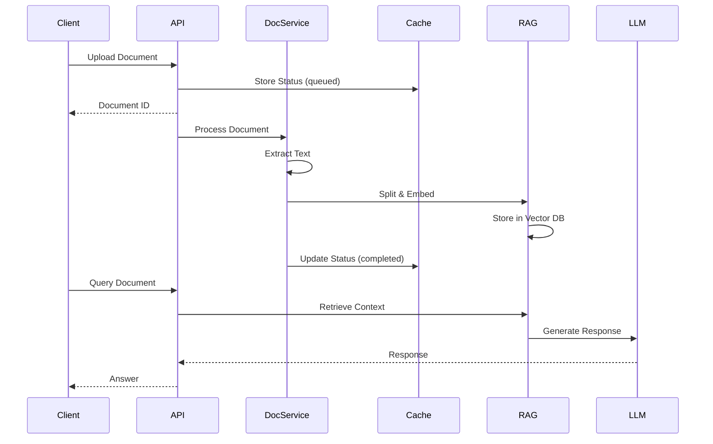
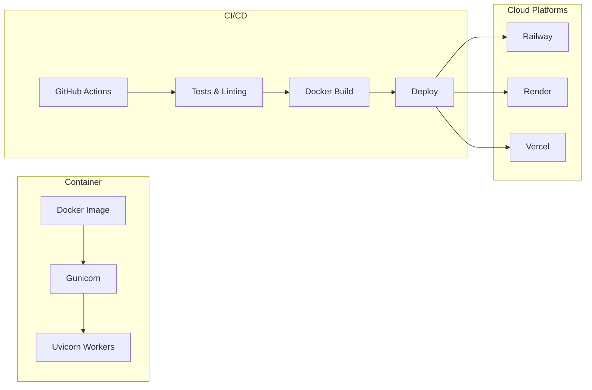

# Document Intelligence System - Software Architecture

## System Overview

Enterprise-grade document processing system combining Azure AI services with advanced language models for document extraction, analysis, and structured information retrieval.

```mermaid
graph TB
    subgraph "Level 1: System Context"
        WEB[Web Application]
        API_CLIENT[API Clients]
    end

    subgraph "Level 2: Containers"
        FASTAPI[FastAPI Application]
        AUTH[Authentication Service]
        DOC_INTEL[Document Intelligence Service]
    end
        RATE_LIMIT[Rate Limiter]
        AUTH[Authentication Service]
    end

    subgraph "Core Services"
        DOC_INTEL[Document Intelligence Service]
        CACHE[Cache Service]
        WS_MGR[WebSocket Manager]
    end

    subgraph "RAG Pipeline"
        TEXT_SPLIT[Text Splitter]
        EMBED[Embedding Service]
        VECTOR[Vector Store]
        RETRIEVAL[Retrieval Service]
        MEMORY[Memory Service]
        PROMPT[Prompt Service]
        CHAT[Chat Service]
        GUARD[Guardrail Service]
    end

    subgraph "External Services"
        AZURE_DOC[Azure Document Intelligence]
        AZURE_OPENAI[Azure OpenAI]
        OLLAMA[Ollama LLM]
    end

    subgraph "Data Layer"
        REDIS[(Redis Cache)]
        POSTGRES[(PostgreSQL/SQLite)]
        CHROMA[(ChromaDB Vector Store)]
    end

    WEB --> FASTAPI
    API_CLIENT --> FASTAPI
    FASTAPI --> RATE_LIMIT
    FASTAPI --> AUTH
    FASTAPI --> DOC_INTEL
    FASTAPI --> CACHE
    FASTAPI --> WS_MGR

    DOC_INTEL --> AZURE_DOC
    DOC_INTEL --> TEXT_SPLIT
    TEXT_SPLIT --> EMBED
    EMBED --> VECTOR
    VECTOR --> RETRIEVAL
    RETRIEVAL --> CHAT
    MEMORY --> CHAT
    PROMPT --> CHAT
    GUARD --> CHAT
    CHAT --> AZURE_OPENAI
    CHAT --> OLLAMA

    CACHE --> REDIS
    DOC_INTEL --> POSTGRES
    VECTOR --> CHROMA
```

---

## Component Architecture

### API Layer (`app/`)

| Component | File | Purpose |
|-----------|------|---------|
| Main Application | `app/main.py` | FastAPI application, routes, middleware |
| Authentication | `app/core/authentication.py` | JWT token management |
| Database | `app/core/database_manager.py` | Async database connections |
| WebSocket | `app/core/websocket_manager.py` | Real-time updates |
| Cache Service | `app/services/cache_service.py` | Redis/memory caching |
| Document Service | `app/services/document_intelligence_service.py` | Document processing |

### RAG Pipeline (`backend/`)

| Component | File | Purpose |
|-----------|------|---------|
| Text Splitter | `backend/services/text_splitter_service.py` | Document chunking |
| Embeddings | `backend/services/embedding_service.py` | Vector embeddings |
| Vector Store | `backend/services/vector_store_service.py` | Similarity search |
| Retrieval | `backend/services/retrieval_service.py` | Context retrieval |
| Memory | `backend/services/memory_service.py` | Conversation history |
| Prompt | `backend/services/prompt_service.py` | Prompt templates |
| Chat | `backend/services/chat_service.py` | LLM integration |
| Guardrails | `backend/services/guardrail_service.py` | Content safety |

---

## Data Flow



---

## Deployment Architecture



---

## Configuration

### Environment Variables

| Category | Variables |
|----------|-----------|
| Application | `ENVIRONMENT`, `SECRET_KEY`, `DEBUG` |
| Azure | `AZURE_OPENAI_API_KEY`, `AZURE_DOCUMENT_INTELLIGENCE_KEY` |
| Database | `DATABASE_URL`, `REDIS_URL` |
| LLM | `OLLAMA_BASE_URL`, `OLLAMA_MODEL` |

### Directory Structure

```
project/
├── app/                    # Main FastAPI application
│   ├── core/              # Authentication, database, WebSocket
│   └── services/          # Document processing, caching
├── backend/               # RAG pipeline services
│   ├── core/              # Configuration
│   ├── models/            # Data models
│   └── services/          # RAG components
├── tests/                 # Test suite
├── docs/                  # Documentation
└── deployment/            # Deployment configs
```

---

## Key Design Decisions

1. **Dual Application Structure**: Separate `app/` (main API) and `backend/` (RAG pipeline) for modularity
2. **Async-First**: All services use async/await for concurrent processing
3. **Fallback Patterns**: Redis falls back to in-memory cache in development
4. **Provider Abstraction**: Support for both Azure OpenAI and local Ollama LLM
5. **Rate Limiting**: SlowAPI for request throttling protection
