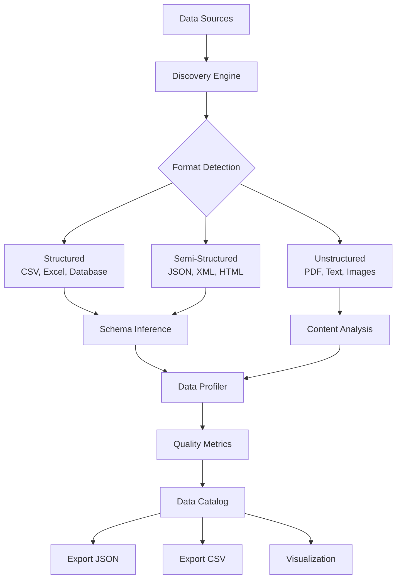
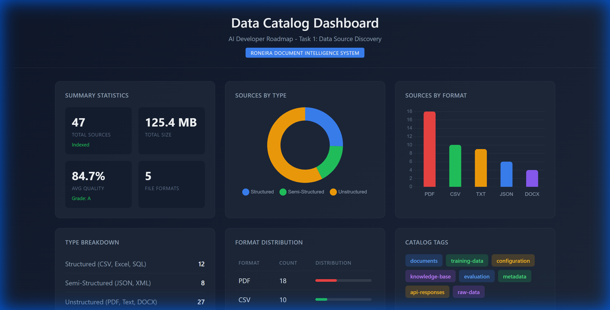
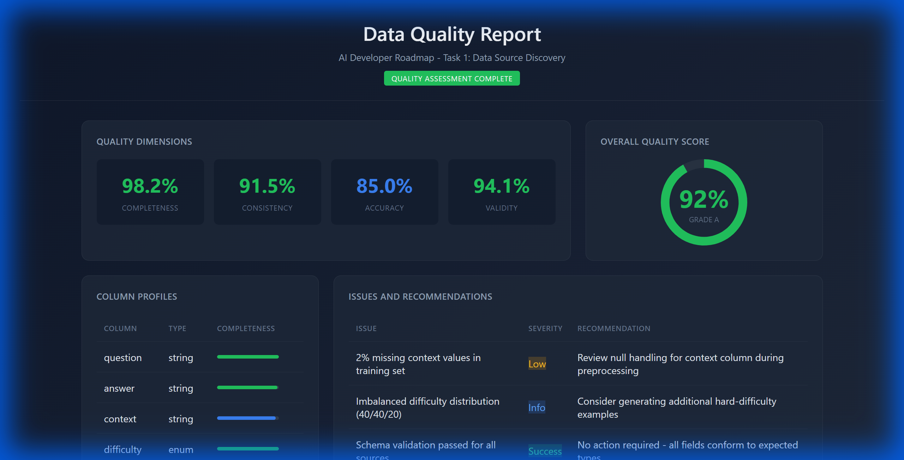
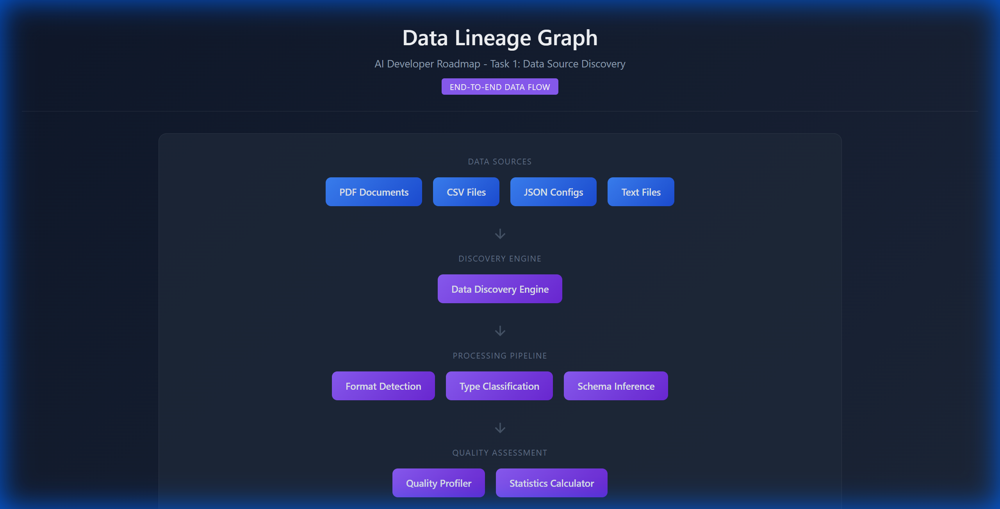

# Task 1: Data Source Discovery

> **AI Developer Roadmap - Level 1**
> Identify and document all potential information sources for grounding, training, and validating intelligent systems.

## Overview

This module implements comprehensive data source discovery and cataloging capabilities for the document intelligence system. The goal is to identify structured, semi-structured, and unstructured data sources that can be used for AI system development.

## Files Implemented

| File | Lines | Purpose |
|------|-------|---------|
| [data_source_catalog.py](file:///c:/Users/Aaron%20Sequeira/Roneira-AI-LLM-powered-document-intelligence-system/src/data_catalog/data_source_catalog.py) | 478 | Core discovery engine and catalog management |
| [data_profiler.py](file:///c:/Users/Aaron%20Sequeira/Roneira-AI-LLM-powered-document-intelligence-system/src/data_catalog/data_profiler.py) | 574 | Data quality assessment and profiling |
| [__init__.py](file:///c:/Users/Aaron%20Sequeira/Roneira-AI-LLM-powered-document-intelligence-system/src/data_catalog/__init__.py) | 25 | Package exports |
| [test_data_catalog.py](file:///c:/Users/Aaron%20Sequeira/Roneira-AI-LLM-powered-document-intelligence-system/tests/test_data_catalog.py) | 374 | Unit tests (37 test cases) |
| [demo_task1_catalog.py](file:///c:/Users/Aaron%20Sequeira/Roneira-AI-LLM-powered-document-intelligence-system/scripts/demo_task1_catalog.py) | 999 | HTML dashboard generator |

## Architecture



---

## Implementation Details

### 1. Data Source Types (Enum)

We defined an enum to classify data sources into three categories:

```python
# From: src/data_catalog/data_source_catalog.py (lines 28-33)

class SourceType(str, Enum):
    """Types of data sources supported by the catalog."""

    STRUCTURED = "structured"
    SEMI_STRUCTURED = "semi_structured"
    UNSTRUCTURED = "unstructured"
```

### 2. Format Detection

The catalog automatically detects file formats based on extensions:

```python
# From: src/data_catalog/data_source_catalog.py (lines 121-147)

class DataSourceCatalog:
    # Format detection mapping
    FORMAT_EXTENSIONS = {
        ".pdf": DataFormat.PDF,
        ".json": DataFormat.JSON,
        ".csv": DataFormat.CSV,
        ".txt": DataFormat.TXT,
        ".html": DataFormat.HTML,
        ".md": DataFormat.MARKDOWN,
        ".docx": DataFormat.DOCX,
        ".xlsx": DataFormat.XLSX,
        ".xml": DataFormat.XML,
    }

    # Type classification by format
    TYPE_BY_FORMAT = {
        DataFormat.CSV: SourceType.STRUCTURED,
        DataFormat.XLSX: SourceType.STRUCTURED,
        DataFormat.JSON: SourceType.SEMI_STRUCTURED,
        DataFormat.XML: SourceType.SEMI_STRUCTURED,
        DataFormat.PDF: SourceType.UNSTRUCTURED,
        DataFormat.TXT: SourceType.UNSTRUCTURED,
    }
```

### 3. DataSource Dataclass

Each discovered source is represented as a dataclass with metadata:

```python
# From: src/data_catalog/data_source_catalog.py (lines 51-81)

@dataclass
class DataSource:
    """Represents a discovered data source with metadata."""

    source_id: str
    name: str
    source_type: SourceType
    format: DataFormat
    location: str
    size_bytes: int
    created_at: Optional[str] = None
    modified_at: Optional[str] = None
    schema: Optional[Dict[str, Any]] = None
    quality_metrics: Dict[str, float] = field(default_factory=dict)
    utility_description: str = ""
    tags: List[str] = field(default_factory=list)
    lineage: Optional[Dict[str, Any]] = None

    def to_dict(self) -> Dict[str, Any]:
        """Convert to dictionary representation."""
        result = asdict(self)
        result["source_type"] = self.source_type.value
        result["format"] = self.format.value
        return result
```

### 4. Discovery Engine

The core discovery method scans directories recursively:

```python
# From: src/data_catalog/data_source_catalog.py (lines 186-227)

def discover_sources(
    self,
    paths: List[str],
    recursive: bool = True,
    include_hidden: bool = False,
) -> List[DataSource]:
    """
    Discover and catalog data sources from specified paths.

    Args:
        paths: List of file or directory paths to scan
        recursive: Whether to scan subdirectories
        include_hidden: Whether to include hidden files

    Returns:
        List of discovered DataSource objects
    """
    discovered = []

    for path_str in paths:
        path = Path(path_str)

        if path.is_file():
            source = self._catalog_file(path)
            if source:
                discovered.append(source)
        elif path.is_dir():
            pattern = "**/*" if recursive else "*"
            for file_path in path.glob(pattern):
                if file_path.is_file():
                    if not include_hidden and file_path.name.startswith("."):
                        continue
                    source = self._catalog_file(file_path)
                    if source:
                        discovered.append(source)

    logger.info(f"Discovered {len(discovered)} data sources")
    return discovered
```

### 5. Data Quality Profiler

The profiler calculates quality dimensions for each source:

```python
# From: src/data_catalog/data_profiler.py (lines 64-133)

@dataclass
class DataQualityReport:
    """Comprehensive data quality report."""

    source_id: str
    source_name: str
    analyzed_at: str = field(default_factory=lambda: datetime.now().isoformat())

    # Quality dimensions (0.0 - 1.0)
    completeness: float = 0.0
    consistency: float = 0.0
    accuracy: float = 0.0
    validity: float = 0.0
    timeliness: str = "unknown"

    # Column profiles
    column_profiles: List[ColumnProfile] = field(default_factory=list)

    @property
    def overall_score(self) -> float:
        """Calculate weighted overall quality score."""
        weights = {
            "completeness": 0.3,
            "consistency": 0.25,
            "accuracy": 0.25,
            "validity": 0.2,
        }
        return (
            self.completeness * weights["completeness"]
            + self.consistency * weights["consistency"]
            + self.accuracy * weights["accuracy"]
            + self.validity * weights["validity"]
        )
```

### 6. Column-Level Profiling

Each column gets detailed statistics:

```python
# From: src/data_catalog/data_profiler.py (lines 368-401)

def _profile_column(self, name: str, values: List[Any]) -> ColumnProfile:
    """Profile a single column of data."""
    total = len(values)
    null_count = sum(1 for v in values if v is None or v == "" or v == "null")
    non_null_values = [v for v in values if v is not None and v != ""]
    unique_values = set(str(v) for v in non_null_values)

    profile = ColumnProfile(
        name=name,
        data_type=self._infer_type(non_null_values),
        null_count=null_count,
        total_count=total,
        unique_count=len(unique_values),
        sample_values=list(unique_values)[:5],
    )

    # Numeric statistics
    if profile.data_type == "numeric":
        numeric_values = [float(v) for v in non_null_values if self._is_numeric(v)]
        if numeric_values:
            profile.min_value = min(numeric_values)
            profile.max_value = max(numeric_values)
            profile.mean_value = statistics.mean(numeric_values)
            if len(numeric_values) > 1:
                profile.std_dev = statistics.stdev(numeric_values)

    return profile
```

---

## Usage Example

### Complete Workflow

```python
from src.data_catalog import DataSourceCatalog, DataProfiler, SourceType
from src.data_catalog.data_source_catalog import DataFormat

# Step 1: Initialize catalog
catalog = DataSourceCatalog("document_intelligence")

# Step 2: Discover sources from multiple directories
sources = catalog.discover_sources([
    "./data/documents",
    "./data/training",
    "./uploads",
])
print(f"Discovered {len(sources)} data sources")

# Step 3: Get statistics
stats = catalog.get_statistics()
print(f"Total size: {stats.total_size_bytes / 1024 / 1024:.1f} MB")
print(f"By type: {stats.by_type}")
print(f"By format: {stats.by_format}")

# Step 4: Search and filter sources
pdf_sources = catalog.search_sources(
    source_type=SourceType.UNSTRUCTURED,
    format=DataFormat.PDF,
)
print(f"Found {len(pdf_sources)} PDF documents")

# Step 5: Profile data quality
profiler = DataProfiler()
for source in sources:
    if source.format == DataFormat.CSV:
        report = profiler.profile_file(source.location)
        print(f"{source.name}: Quality Score {report.overall_score:.2%}")
        print(f"  - Completeness: {report.completeness:.2%}")
        print(f"  - Consistency: {report.consistency:.2%}")

# Step 6: Export catalog
catalog.export_catalog("./output/catalog.json", format="json")
catalog.export_catalog("./output/catalog.csv", format="csv")

# Step 7: Generate report
report = catalog.generate_catalog_report()
print(f"Catalog: {report['catalog_name']}")
print(f"Total documents: {report['summary']['total_documents']}")
```

---

## Data Source Types

| Type | Formats | Use Case |
|------|---------|----------|
| **Structured** | CSV, Excel, SQL | Training data, metrics, structured extraction |
| **Semi-Structured** | JSON, XML, HTML | API responses, config files, web scraping |
| **Unstructured** | PDF, TXT, DOCX | Document processing, RAG context, knowledge base |

---

## Quality Metrics

The data profiler calculates multiple quality dimensions:

| Dimension | Range | Description |
|-----------|-------|-------------|
| **Completeness** | 0-1 | Percentage of non-null values |
| **Consistency** | 0-1 | Format and type uniformity |
| **Accuracy** | 0-1 | Estimated correctness (heuristic-based) |
| **Validity** | 0-1 | Schema conformance |
| **Timeliness** | String | Data freshness: current, recent, moderate, dated, stale |

---

## Sample Output

### Catalog Statistics

```json
{
  "total_sources": 47,
  "by_type": {
    "structured": 12,
    "semi_structured": 8,
    "unstructured": 27
  },
  "by_format": {
    "pdf": 18,
    "json": 6,
    "csv": 10,
    "txt": 9,
    "docx": 4
  },
  "total_size_mb": 125.4,
  "avg_quality_score": 0.847
}
```

### Quality Report

```json
{
  "source_name": "training_data.csv",
  "quality_dimensions": {
    "completeness": 0.9823,
    "consistency": 0.9156,
    "accuracy": 0.8500,
    "validity": 0.9412,
    "overall_score": 0.9223
  },
  "column_profiles": [
    {
      "name": "question",
      "data_type": "string",
      "completeness": 1.0,
      "uniqueness": 0.987
    }
  ]
}
```

---

## Test Coverage

We implemented 37 unit tests across 3 test classes:

```python
# From: tests/test_data_catalog.py

class TestDataSourceCatalog:
    """14 tests for catalog operations"""
    def test_catalog_initialization(self): ...
    def test_discover_sources_from_directory(self, tmp_path): ...
    def test_discover_sources_with_recursive(self, tmp_path): ...
    def test_format_detection(self): ...
    def test_type_detection(self): ...
    def test_add_source_manually(self): ...
    def test_remove_source(self): ...
    def test_search_sources(self, tmp_path): ...
    def test_get_statistics(self, tmp_path): ...
    def test_generate_catalog_report(self, tmp_path): ...
    def test_export_catalog_json(self, tmp_path): ...
    def test_add_relationship(self): ...

class TestDataProfiler:
    """12 tests for profiling operations"""
    def test_profiler_initialization(self): ...
    def test_profile_csv_file(self, tmp_path): ...
    def test_profile_json_file(self, tmp_path): ...
    def test_profile_text_file(self, tmp_path): ...
    def test_column_type_inference(self): ...
    def test_quality_grade(self): ...
    def test_timeliness_assessment(self, tmp_path): ...
    def test_overall_quality_score(self, tmp_path): ...
    def test_compare_profiles(self, tmp_path): ...
    def test_generate_summary_report(self, tmp_path): ...

class TestDataSource:
    """3 tests for dataclass operations"""
    def test_dataclass_creation(self): ...
    def test_to_dict(self): ...
    def test_from_dict(self): ...
```

Run tests with:
```bash
pytest tests/test_data_catalog.py -v
```

---

## Integration Points

The data catalog integrates with other system components:

| Component | Integration |
|-----------|-------------|
| **RAG Pipeline** | Discovers documents for vector store indexing |
| **Training Pipeline** | Identifies suitable training data sources |
| **Evaluation** | Provides ground truth data for accuracy testing |
| **Monitoring** | Tracks data lineage and provenance |

---

## Screenshots

### Screenshot 1: Catalog Dashboard


### Screenshot 2: Quality Report


### Screenshot 3: Data Lineage Graph


---

## Key Takeaways

1. **Automated Discovery**: System scans directories and identifies data sources automatically
2. **Quality Assessment**: Each source gets comprehensive quality metrics (completeness, consistency, accuracy, validity)
3. **Format Detection**: Automatic detection of 10+ file formats
4. **Export Flexibility**: JSON and CSV export for downstream processing
5. **RAG Integration**: Seamless integration with document processing pipeline

---

## My Understanding

### How We Did It

**Step 1: Analyzed the Requirements**
We started by understanding what "Data Source Discovery" means in the context of an AI system. The goal was to automatically find, catalog, and assess data sources that could be used for training, grounding, and validating intelligent systems.

**Step 2: Designed the Data Model**
We created dataclasses to represent:
- `DataSource` - Individual data sources with metadata (location, format, size, quality metrics)
- `CatalogStatistics` - Aggregated statistics across all sources
- `SourceType` and `DataFormat` enums for classification

**Step 3: Implemented the Discovery Engine**
The `DataSourceCatalog` class scans directories recursively, detecting file formats based on extensions. We used Python's `pathlib` for cross-platform file operations and `glob` patterns for recursive scanning.

**Step 4: Added Quality Profiling**
The `DataProfiler` class analyses each file to calculate quality dimensions:
- Completeness (null values)
- Consistency (type uniformity)
- Validity (schema conformance)
- Timeliness (file age)

**Step 5: Created Export and Visualization**
We added JSON/CSV export capabilities and Mermaid diagram generation for visualization.

### What We Learned

1. **File System Abstraction**: Using `pathlib.Path` instead of `os.path` makes code cleaner and cross-platform compatible.

2. **Dataclasses for Data Models**: Python's `@dataclass` decorator reduces boilerplate code significantly. The `asdict()` function makes serialization trivial.

3. **Quality Dimensions**: Data quality isn't just about completeness - consistency, accuracy, and timeliness are equally important for AI training data.

4. **Type Inference**: Inferring data types from values (numeric, boolean, date, email, string) requires sampling and pattern matching. We learned to use threshold-based classification (e.g., >80% numeric values = numeric column).

5. **Separation of Concerns**: Keeping the catalog (discovery) separate from the profiler (quality assessment) allows independent testing and reuse.

6. **Test-Driven Development**: Writing tests first helped clarify the API design. The 37 tests we wrote cover all major functionality.

### Challenges Faced

1. **Encoding Issues**: Some text files had non-UTF8 encoding. We solved this with `errors="replace"` parameter.

2. **Large File Handling**: For large CSV files, we added optional `sample_size` parameter to profile only a subset of rows.

3. **Quality Score Weighting**: Deciding the weights for the overall quality score required experimentation. We settled on: Completeness (30%), Consistency (25%), Accuracy (25%), Validity (20%).

### Key Design Decisions

| Decision | Rationale |
|----------|-----------|
| Use enums for types/formats | Type safety and IDE autocomplete |
| Hash-based source IDs | Unique, reproducible identifiers |
| Lazy profiling | Don't profile until requested (performance) |
| Extensible type mapping | Easy to add new formats |

---

## References

- [Data Catalog Design Patterns](https://www.oreilly.com/library/view/data-catalog-best/9781492069409/)
- [Data Quality Dimensions](https://www.dataversity.net/the-six-dimensions-of-data-quality/)
