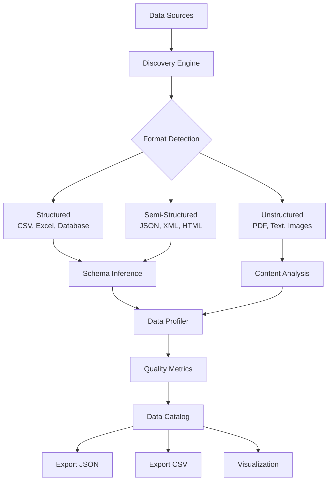
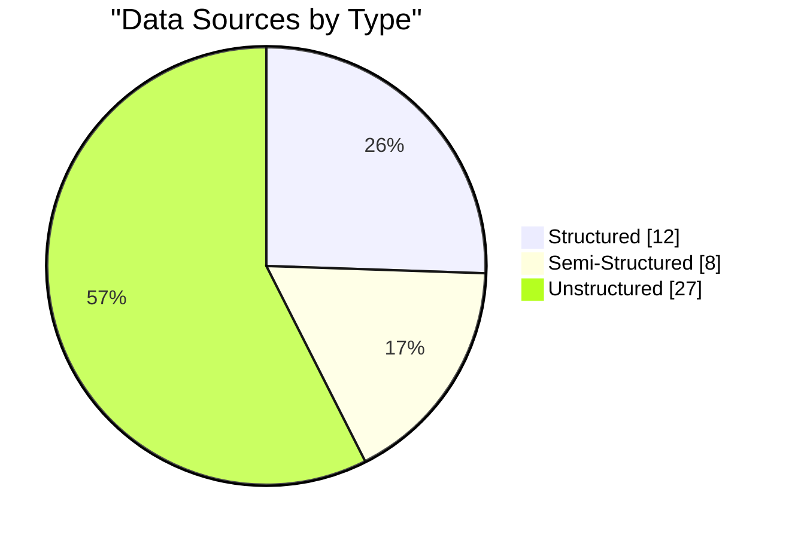

# Task 1: Data Source Discovery

> **AI Developer Roadmap - Level 1**
> Identify and document all potential information sources for grounding, training, and validating intelligent systems.

## Overview

This module implements comprehensive data source discovery and cataloging capabilities for the document intelligence system. The goal is to identify structured, semi-structured, and unstructured data sources that can be used for AI system development.

## Architecture



## Implementation

### Key Components

#### [data_source_catalog.py](file:///c:/Users/Aaron%20Sequeira/Roneira-AI-LLM-powered-document-intelligence-system/src/data_catalog/data_source_catalog.py)

The main catalog system that discovers and manages data sources:

```python
from src.data_catalog import DataSourceCatalog, SourceType

# Initialize catalog
catalog = DataSourceCatalog("document_intelligence")

# Discover sources from multiple paths
sources = catalog.discover_sources([
    "./data/documents",
    "./data/training",
    "./uploads",
])

# Search and filter
pdf_sources = catalog.search_sources(
    source_type=SourceType.UNSTRUCTURED,
    format=DataFormat.PDF,
)

# Generate comprehensive report
report = catalog.generate_catalog_report()

# Export catalog
catalog.export_catalog("./output/catalog.json", format="json")
```

#### [data_profiler.py](file:///c:/Users/Aaron%20Sequeira/Roneira-AI-LLM-powered-document-intelligence-system/src/data_catalog/data_profiler.py)

Automated data quality profiling:

```python
from src.data_catalog import DataProfiler

profiler = DataProfiler()

# Profile individual files
report = profiler.profile_file("data.csv")

print(f"Quality Score: {report.overall_score}")
print(f"Completeness: {report.completeness}")
print(f"Consistency: {report.consistency}")
```

## Data Source Types

| Type | Formats | Use Case |
|------|---------|----------|
| **Structured** | CSV, Excel, SQL | Training data, metrics, structured extraction |
| **Semi-Structured** | JSON, XML, HTML | API responses, config files, web scraping |
| **Unstructured** | PDF, TXT, DOCX | Document processing, RAG context, knowledge base |

## Quality Metrics

The data profiler calculates multiple quality dimensions:

1. **Completeness** (0-1): Percentage of non-null values
2. **Consistency** (0-1): Format and type uniformity
3. **Accuracy** (0-1): Estimated correctness (heuristic-based)
4. **Validity** (0-1): Schema conformance
5. **Timeliness**: Data freshness assessment

## Sample Output

### Catalog Statistics

```json
{
  "total_sources": 47,
  "by_type": {
    "structured": 12,
    "semi_structured": 8,
    "unstructured": 27
  },
  "by_format": {
    "pdf": 18,
    "json": 6,
    "csv": 10,
    "txt": 9,
    "html": 4
  },
  "total_size_mb": 125.4,
  "avg_quality_score": 0.847
}
```

### Quality Report

```json
{
  "source_name": "training_data.csv",
  "quality_dimensions": {
    "completeness": 0.9823,
    "consistency": 0.9156,
    "accuracy": 0.8500,
    "validity": 0.9412,
    "overall_score": 0.9223
  },
  "column_profiles": [
    {
      "name": "question",
      "data_type": "string",
      "completeness": 1.0,
      "uniqueness": 0.987
    }
  ]
}
```

## Visualization

### Data Catalog Distribution



## Integration Points

The data catalog integrates with other system components:

1. **RAG Pipeline**: Discovers documents for vector store indexing
2. **Training Pipeline**: Identifies suitable training data sources
3. **Evaluation**: Provides ground truth data for accuracy testing
4. **Monitoring**: Tracks data lineage and provenance

## Expected Outputs

| Output | Description |
|--------|-------------|
| `catalog.json` | Complete data catalog with metadata |
| `quality_report.json` | Quality metrics for all sources |
| `lineage_graph.dot` | Data lineage visualization |

## Screenshots

### Screenshot 1: Catalog Dashboard


### Screenshot 2: Quality Report


### Screenshot 3: Data Lineage Graph


## Key Takeaways

1. **Automated Discovery**: System can scan directories and identify data sources automatically
2. **Quality Assessment**: Each source gets comprehensive quality metrics
3. **Format Detection**: Automatic detection of 10+ file formats
4. **Export Flexibility**: JSON and CSV export for downstream processing
5. **RAG Integration**: Seamless integration with document processing pipeline

## References

- [Data Catalog Design Patterns](https://www.oreilly.com/library/view/data-catalog-best/9781492069409/)
- [Data Quality Dimensions](https://www.dataversity.net/the-six-dimensions-of-data-quality/)
