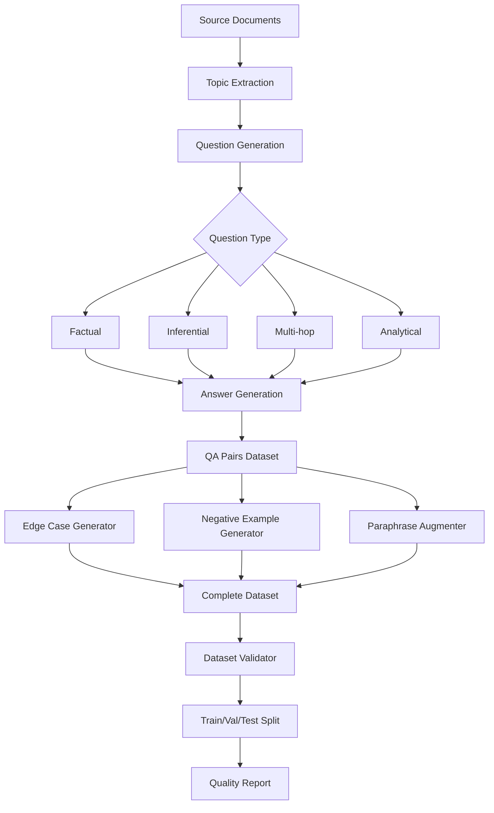
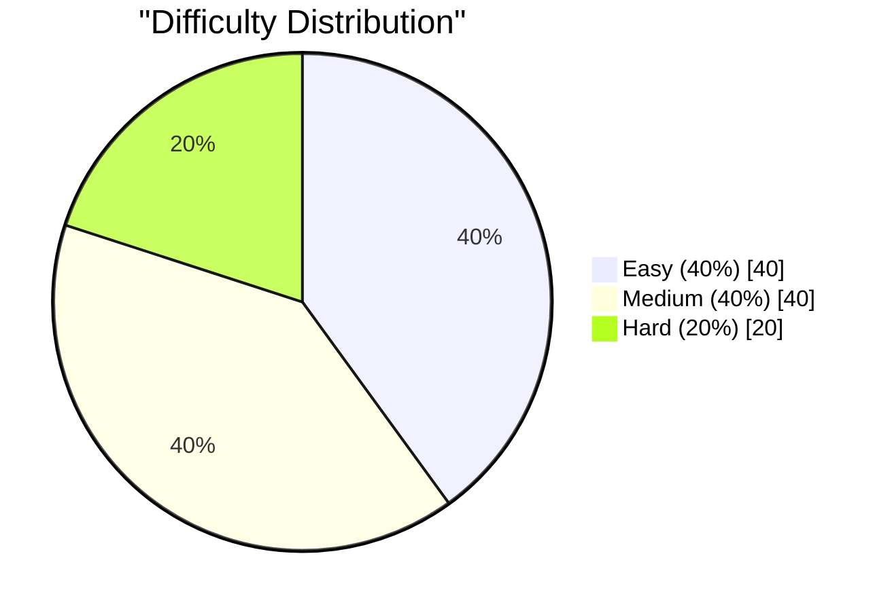

# Task 2: Training & Test Data Generation

> **AI Developer Roadmap - Level 1**
> Construct a conceptual dataset framework representing real-world interactions, including variations, edge scenarios, and negative cases.

## Overview

This module implements synthetic data generation for training, testing, and validating the RAG system. It creates high-quality QA pairs, edge cases, and negative examples to ensure comprehensive model evaluation.

## Architecture



## Implementation

### Key Components

#### [synthetic_data_generator.py](file:///c:/Users/Aaron%20Sequeira/Roneira-AI-LLM-powered-document-intelligence-system/src/data_generation/synthetic_data_generator.py)

LLM-powered training data generation:

```python
from src.data_generation import SyntheticDataGenerator, GenerationConfig

# Configure generation
config = GenerationConfig(
    num_samples=1000,
    difficulty_distribution={"easy": 0.4, "medium": 0.4, "hard": 0.2},
    question_types=["factual", "inferential", "analytical"],
    include_negative_examples=True,
    negative_ratio=0.2,
)

generator = SyntheticDataGenerator(config)

# Generate from documents
documents = ["Document 1 content...", "Document 2 content..."]
qa_pairs = generator.generate_qa_pairs(documents, num_samples=500)

# Generate edge cases and negative examples
edge_cases = generator.generate_edge_cases(qa_pairs)
negatives = generator.generate_negative_examples(qa_pairs)

# Augment with paraphrasing
augmented = generator.augment_with_paraphrasing(qa_pairs, augmentation_factor=2)

# Export dataset
generator.export_dataset("./output/training_data.json")
```

#### [dataset_validator.py](file:///c:/Users/Aaron%20Sequeira/Roneira-AI-LLM-powered-document-intelligence-system/src/data_generation/dataset_validator.py)

Dataset splitting and quality validation:

```python
from src.data_generation import DatasetValidator

validator = DatasetValidator(seed=42)

# Create stratified splits
split = validator.create_splits(
    data=qa_pairs,
    ratios=(0.7, 0.15, 0.15),
    stratify_by="difficulty",
)

# Validate quality
report = validator.validate(split, dataset_name="RAG Training Set")

print(f"Quality Grade: {report.quality_grade}")
print(f"Has Leakage: {report.leakage_report.has_leakage}")

# Export splits
validator.export_splits(split, "./output/splits/")
```

## Question Types

| Type | Description | Example |
|------|-------------|---------|
| **Factual** | Direct fact retrieval | "What is the capital of France?" |
| **Inferential** | Requires reasoning | "Why might inflation affect housing prices?" |
| **Multi-hop** | Multiple pieces of information | "Given X and Y, what is Z?" |
| **Analytical** | Deep analysis | "Compare and contrast A with B" |
| **Comparison** | Comparative analysis | "How does X differ from Y?" |

## Dataset Components

### 1. Positive Examples
Standard question-answer pairs grounded in source documents.

### 2. Negative Examples
Questions that cannot be answered from the given context:
- Context mismatch scenarios
- Out-of-scope questions
- Ambiguous queries

### 3. Edge Cases
Boundary conditions and special scenarios:
- Empty/null handling
- Special characters
- Maximum/minimum values
- Incomplete data

### 4. Augmented Examples
Paraphrased versions for diversity:
- Question rephrasing
- Answer reformulation
- Context variations

## Difficulty Distribution



## Validation Metrics

The dataset validator checks for:

| Metric | Description | Threshold |
|--------|-------------|-----------|
| **Completeness** | All fields populated | > 95% |
| **Diversity** | Vocabulary uniqueness | > 50% |
| **Balance** | Distribution evenness | Coefficient of Variation < 0.3 |
| **Leakage** | Train/test overlap | 0% |

## Sample QA Pair

```json
{
  "id": "qa_20260108_000001",
  "question": "What are the key features of document intelligence systems?",
  "answer": "Document intelligence systems feature automated content extraction, semantic understanding, and intelligent categorization of documents.",
  "context": "Document intelligence systems provide automated extraction of content from various document formats, enabling semantic understanding and intelligent categorization...",
  "difficulty": "medium",
  "question_type": "factual",
  "category": "document_processing",
  "is_negative": false,
  "is_edge_case": false
}
```

## Validation Report

```json
{
  "dataset_name": "RAG Training Set",
  "quality_grade": "A",
  "split_info": {
    "train_size": 700,
    "validation_size": 150,
    "test_size": 150,
    "total_size": 1000
  },
  "quality_metrics": {
    "train": {
      "completeness": 0.98,
      "diversity_score": 0.72,
      "balance_score": 0.89,
      "unique_question_ratio": 0.99
    }
  },
  "leakage_report": {
    "has_leakage": false,
    "leakage_score": 0.0
  }
}
```

## Split Statistics

| Split | Size | Easy | Medium | Hard |
|-------|------|------|--------|------|
| Train | 700 | 280 | 280 | 140 |
| Validation | 150 | 60 | 60 | 30 |
| Test | 150 | 60 | 60 | 30 |

## Integration Points

1. **RAG Evaluation**: Test set for retrieval and generation metrics
2. **Fine-tuning**: Training data for model adaptation
3. **Benchmarking**: Consistent evaluation across model versions
4. **A/B Testing**: Comparative performance analysis

## Screenshots

### Screenshot 1: Generated QA Pairs


### Screenshot 2: Dataset Statistics


### Screenshot 3: Validation Report


## Key Takeaways

1. **Diverse Generation**: Multiple question types and difficulty levels
2. **Quality Validation**: Comprehensive checks prevent data leakage
3. **Stratified Splitting**: Maintains distribution across splits
4. **Augmentation**: Paraphrasing increases dataset diversity
5. **Edge Coverage**: Explicit handling of boundary conditions

## References

- [SQuAD Dataset Guidelines](https://rajpurkar.github.io/SQuAD-explorer/)
- [Synthetic Data Generation Best Practices](https://arxiv.org/abs/2307.04787)
- [Data Augmentation Techniques for NLP](https://aclanthology.org/2020.emnlp-main.346/)
