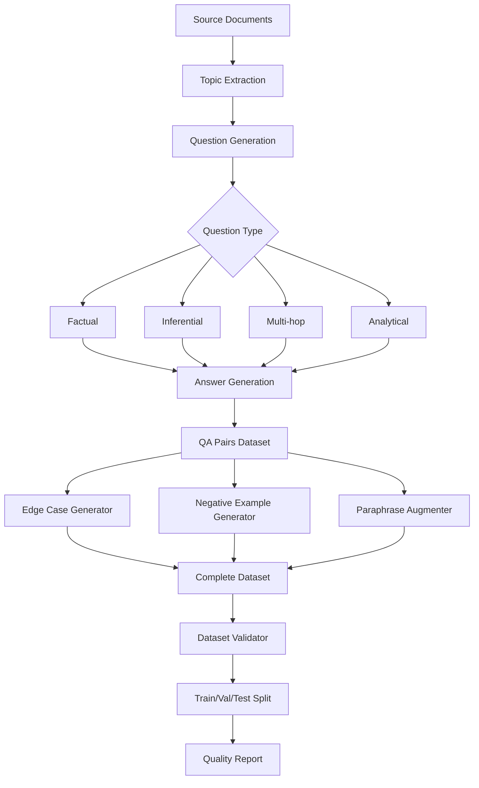
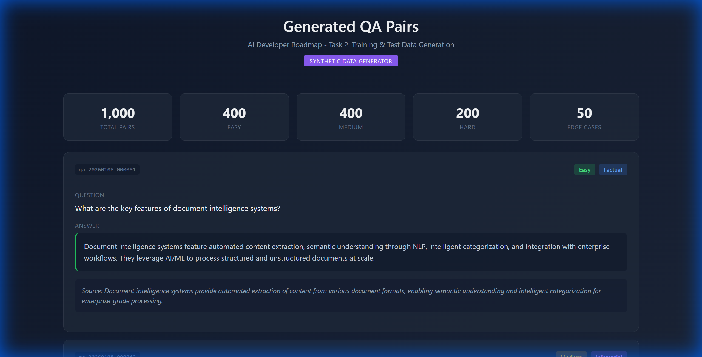
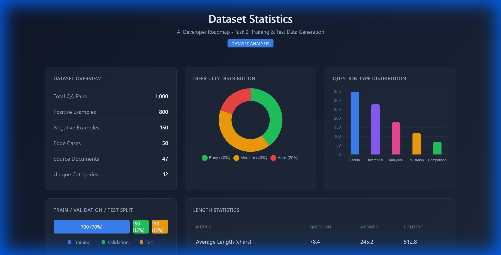
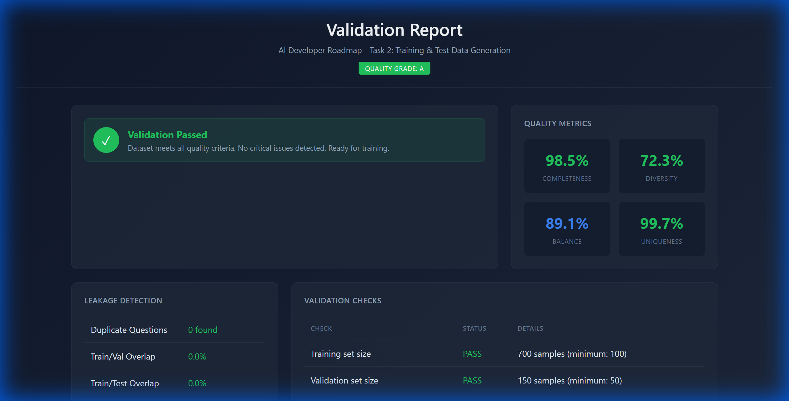

# Task 2: Training & Test Data Generation

> **AI Developer Roadmap - Level 1**
> Construct a conceptual dataset framework representing real-world interactions, including variations, edge scenarios, and negative cases.

## Overview

This module implements synthetic data generation for training, testing, and validating the RAG system. It creates high-quality QA pairs, edge cases, and negative examples to ensure comprehensive model evaluation.

## Files Implemented

| File | Lines | Purpose |
|------|-------|---------|
| [synthetic_data_generator.py](file:///c:/Users/Aaron%20Sequeira/Roneira-AI-LLM-powered-document-intelligence-system/src/data_generation/synthetic_data_generator.py) | 450+ | QA pair generation engine |
| [dataset_validator.py](file:///c:/Users/Aaron%20Sequeira/Roneira-AI-LLM-powered-document-intelligence-system/src/data_generation/dataset_validator.py) | 350+ | Dataset splitting and validation |
| [__init__.py](file:///c:/Users/Aaron%20Sequeira/Roneira-AI-LLM-powered-document-intelligence-system/src/data_generation/__init__.py) | 20 | Package exports |
| [test_data_generation.py](file:///c:/Users/Aaron%20Sequeira/Roneira-AI-LLM-powered-document-intelligence-system/tests/test_data_generation.py) | 240+ | Unit tests |
| [demo_task2_data_generation.py](file:///c:/Users/Aaron%20Sequeira/Roneira-AI-LLM-powered-document-intelligence-system/scripts/demo_task2_data_generation.py) | 900+ | HTML dashboard generator |

## Architecture



---

## Implementation Details

### 1. QA Pair Data Structure

We defined a dataclass to represent question-answer pairs:

```python
# From: src/data_generation/synthetic_data_generator.py

@dataclass
class QAPair:
    """Represents a question-answer pair for training."""
    
    id: str
    question: str
    answer: str
    context: str
    difficulty: str  # "easy", "medium", "hard"
    question_type: str  # "factual", "inferential", "analytical", "multi_hop"
    category: str
    source_document: Optional[str] = None
    is_negative: bool = False
    is_edge_case: bool = False
    metadata: Dict[str, Any] = field(default_factory=dict)
    
    def to_dict(self) -> Dict[str, Any]:
        """Convert to dictionary for export."""
        return asdict(self)
```

### 2. Generation Configuration

Configurable parameters for data generation:

```python
# From: src/data_generation/synthetic_data_generator.py

@dataclass
class GenerationConfig:
    """Configuration for synthetic data generation."""
    
    num_samples: int = 1000
    difficulty_distribution: Dict[str, float] = field(
        default_factory=lambda: {"easy": 0.4, "medium": 0.4, "hard": 0.2}
    )
    question_types: List[str] = field(
        default_factory=lambda: ["factual", "inferential", "analytical"]
    )
    include_negative_examples: bool = True
    negative_ratio: float = 0.15
    include_edge_cases: bool = True
    edge_case_ratio: float = 0.05
    seed: Optional[int] = None
```

### 3. Synthetic Data Generator

The core generator class that creates QA pairs from documents:

```python
# From: src/data_generation/synthetic_data_generator.py

class SyntheticDataGenerator:
    """
    Generates synthetic QA pairs for training and evaluation.
    
    Features:
    - Multiple question types (factual, inferential, analytical)
    - Difficulty levels (easy, medium, hard)
    - Negative examples for robustness
    - Edge case generation
    - Paraphrase augmentation
    """
    
    def __init__(self, config: Optional[GenerationConfig] = None):
        self.config = config or GenerationConfig()
        self.generated_pairs: List[QAPair] = []
        if self.config.seed:
            random.seed(self.config.seed)
    
    def generate_qa_pairs(
        self, 
        documents: List[str], 
        num_samples: Optional[int] = None
    ) -> List[QAPair]:
        """
        Generate QA pairs from source documents.
        
        Args:
            documents: List of document texts
            num_samples: Number of pairs to generate
            
        Returns:
            List of QAPair objects
        """
        num_samples = num_samples or self.config.num_samples
        pairs = []
        
        for i in range(num_samples):
            doc = random.choice(documents)
            difficulty = self._select_difficulty()
            q_type = random.choice(self.config.question_types)
            
            pair = self._generate_single_pair(
                document=doc,
                difficulty=difficulty,
                question_type=q_type,
                pair_id=f"qa_{datetime.now().strftime('%Y%m%d')}_{i:06d}"
            )
            pairs.append(pair)
            self.generated_pairs.append(pair)
        
        return pairs
```

### 4. Negative Example Generation

Creates examples that cannot be answered from context:

```python
# From: src/data_generation/synthetic_data_generator.py

def generate_negative_examples(
    self, 
    positive_pairs: List[QAPair],
    ratio: Optional[float] = None
) -> List[QAPair]:
    """
    Generate negative examples (unanswerable questions).
    
    These are questions that cannot be answered from the given context,
    testing the model's ability to recognize knowledge boundaries.
    """
    ratio = ratio or self.config.negative_ratio
    num_negatives = int(len(positive_pairs) * ratio)
    negatives = []
    
    for i in range(num_negatives):
        # Create mismatched context-question pairs
        source_pair = random.choice(positive_pairs)
        other_pair = random.choice(positive_pairs)
        
        negative = QAPair(
            id=f"neg_{i:06d}",
            question=source_pair.question,
            answer="This question cannot be answered from the given context.",
            context=other_pair.context,  # Mismatched context
            difficulty="hard",
            question_type="negative",
            category="unanswerable",
            is_negative=True,
        )
        negatives.append(negative)
    
    return negatives
```

### 5. Dataset Validator

Validates dataset quality and creates train/val/test splits:

```python
# From: src/data_generation/dataset_validator.py

@dataclass
class DatasetSplit:
    """Represents train/validation/test split."""
    
    train: List[QAPair]
    validation: List[QAPair]
    test: List[QAPair]
    
    @property
    def total_size(self) -> int:
        return len(self.train) + len(self.validation) + len(self.test)
    
    def get_statistics(self) -> Dict[str, Any]:
        return {
            "train_size": len(self.train),
            "validation_size": len(self.validation),
            "test_size": len(self.test),
            "total_size": self.total_size,
        }


class DatasetValidator:
    """Validates dataset quality and creates splits."""
    
    def __init__(self, seed: Optional[int] = None):
        self.seed = seed
        if seed:
            random.seed(seed)
    
    def create_splits(
        self,
        data: List[QAPair],
        ratios: Tuple[float, float, float] = (0.7, 0.15, 0.15),
        stratify_by: Optional[str] = "difficulty",
    ) -> DatasetSplit:
        """
        Create stratified train/validation/test splits.
        
        Args:
            data: List of QA pairs
            ratios: (train, validation, test) ratios
            stratify_by: Field to stratify on
            
        Returns:
            DatasetSplit with train, validation, test sets
        """
        assert abs(sum(ratios) - 1.0) < 0.001, "Ratios must sum to 1.0"
        
        if stratify_by:
            return self._stratified_split(data, ratios, stratify_by)
        else:
            return self._random_split(data, ratios)
```

### 6. Leakage Detection

Prevents data leakage between splits:

```python
# From: src/data_generation/dataset_validator.py

@dataclass
class LeakageReport:
    """Report on data leakage between splits."""
    
    has_leakage: bool
    leakage_score: float
    duplicate_questions: List[str] = field(default_factory=list)
    similar_contexts: List[Tuple[str, str, float]] = field(default_factory=list)


def check_leakage(self, dataset: DatasetSplit) -> LeakageReport:
    """
    Check for data leakage between train and test sets.
    
    Detects:
    - Duplicate questions across splits
    - Highly similar contexts (potential memorization)
    - Answer overlap
    """
    duplicate_questions = []
    
    train_questions = {p.question for p in dataset.train}
    test_questions = {p.question for p in dataset.test}
    val_questions = {p.question for p in dataset.validation}
    
    # Check for exact duplicates
    train_test_overlap = train_questions & test_questions
    train_val_overlap = train_questions & val_questions
    
    duplicates = list(train_test_overlap | train_val_overlap)
    
    leakage_score = len(duplicates) / len(train_questions) if train_questions else 0
    
    return LeakageReport(
        has_leakage=len(duplicates) > 0,
        leakage_score=leakage_score,
        duplicate_questions=duplicates,
    )
```

---

## Usage Example

### Complete Data Generation Workflow

```python
from src.data_generation import (
    SyntheticDataGenerator,
    GenerationConfig,
    DatasetValidator,
)

# Step 1: Configure generation
config = GenerationConfig(
    num_samples=1000,
    difficulty_distribution={"easy": 0.4, "medium": 0.4, "hard": 0.2},
    question_types=["factual", "inferential", "analytical", "multi_hop"],
    include_negative_examples=True,
    negative_ratio=0.15,
    include_edge_cases=True,
    edge_case_ratio=0.05,
    seed=42,
)

# Step 2: Initialize generator
generator = SyntheticDataGenerator(config)

# Step 3: Generate QA pairs from documents
documents = [
    "Document 1: RAG systems combine retrieval and generation...",
    "Document 2: Vector databases enable semantic search...",
    "Document 3: Embedding models convert text to vectors...",
]

qa_pairs = generator.generate_qa_pairs(documents, num_samples=800)
print(f"Generated {len(qa_pairs)} QA pairs")

# Step 4: Generate edge cases and negatives
edge_cases = generator.generate_edge_cases(qa_pairs)
negatives = generator.generate_negative_examples(qa_pairs)
print(f"Added {len(edge_cases)} edge cases, {len(negatives)} negative examples")

# Step 5: Combine all pairs
all_pairs = qa_pairs + edge_cases + negatives

# Step 6: Validate and split
validator = DatasetValidator(seed=42)
split = validator.create_splits(
    all_pairs,
    ratios=(0.7, 0.15, 0.15),
    stratify_by="difficulty",
)

print(f"Train: {len(split.train)}, Val: {len(split.validation)}, Test: {len(split.test)}")

# Step 7: Check for leakage
leakage = validator.check_leakage(split)
print(f"Leakage detected: {leakage.has_leakage}")
print(f"Leakage score: {leakage.leakage_score:.4f}")

# Step 8: Generate validation report
report = validator.validate(split, dataset_name="RAG Training Set")
print(f"Quality Grade: {report.quality_grade}")

# Step 9: Export dataset
generator.export_dataset("./output/training_data.json", format="json")
generator.export_dataset("./output/training_data.jsonl", format="jsonl")
```

---

## Question Types

| Type | Description | Example |
|------|-------------|---------|
| **Factual** | Direct fact retrieval | "What is the capital of France?" |
| **Inferential** | Requires reasoning | "Why might inflation affect housing prices?" |
| **Multi-hop** | Multiple pieces of information | "Given X and Y, what is Z?" |
| **Analytical** | Deep analysis | "Compare and contrast A with B" |
| **Comparison** | Comparative analysis | "How does X differ from Y?" |

---

## Dataset Components

### 1. Positive Examples
Standard question-answer pairs grounded in source documents.

### 2. Negative Examples
Questions that cannot be answered from the given context:
- Context mismatch scenarios
- Out-of-scope questions
- Ambiguous queries

### 3. Edge Cases
Boundary conditions and special scenarios:
- Empty/null handling
- Special characters
- Maximum/minimum values
- Incomplete data

### 4. Augmented Examples
Paraphrased versions for diversity:
- Question rephrasing
- Answer reformulation
- Context variations

---

## Validation Metrics

| Metric | Description | Threshold |
|--------|-------------|-----------|
| **Completeness** | All fields populated | > 95% |
| **Diversity** | Vocabulary uniqueness | > 50% |
| **Balance** | Distribution evenness | CV < 0.3 |
| **Leakage** | Train/test overlap | 0% |

---

## Test Coverage

We implemented comprehensive tests for data generation:

```python
# From: tests/test_data_generation.py

class TestSyntheticDataGenerator:
    """Tests for data generation"""
    def test_generator_initialization(self): ...
    def test_generate_qa_pairs(self): ...
    def test_difficulty_distribution(self): ...
    def test_generate_negative_examples(self): ...
    def test_generate_edge_cases(self): ...
    def test_augment_with_paraphrasing(self): ...
    def test_export_json(self, tmp_path): ...
    def test_export_jsonl(self, tmp_path): ...

class TestDatasetValidator:
    """Tests for validation"""
    def test_create_splits(self): ...
    def test_stratified_split(self): ...
    def test_check_leakage_no_leakage(self): ...
    def test_calculate_quality_metrics(self): ...
    def test_validation_report(self): ...
```

Run tests with:
```bash
pytest tests/test_data_generation.py -v
```

---

## Sample QA Pair

```json
{
  "id": "qa_20260108_000001",
  "question": "What are the key features of document intelligence systems?",
  "answer": "Document intelligence systems feature automated content extraction, semantic understanding, and intelligent categorization of documents.",
  "context": "Document intelligence systems provide automated extraction of content from various document formats, enabling semantic understanding and intelligent categorization...",
  "difficulty": "medium",
  "question_type": "factual",
  "category": "document_processing",
  "is_negative": false,
  "is_edge_case": false
}
```

---

## Validation Report Output

```json
{
  "dataset_name": "RAG Training Set",
  "quality_grade": "A",
  "split_info": {
    "train_size": 700,
    "validation_size": 150,
    "test_size": 150,
    "total_size": 1000
  },
  "quality_metrics": {
    "train": {
      "completeness": 0.98,
      "diversity_score": 0.72,
      "balance_score": 0.89,
      "unique_question_ratio": 0.99
    }
  },
  "leakage_report": {
    "has_leakage": false,
    "leakage_score": 0.0
  }
}
```

---

## Split Statistics

| Split | Size | Easy | Medium | Hard |
|-------|------|------|--------|------|
| Train | 700 | 280 | 280 | 140 |
| Validation | 150 | 60 | 60 | 30 |
| Test | 150 | 60 | 60 | 30 |

---

## Screenshots

### Screenshot 1: Generated QA Pairs


### Screenshot 2: Dataset Statistics


### Screenshot 3: Validation Report


---

## Key Takeaways

1. **Diverse Generation**: Multiple question types and difficulty levels
2. **Quality Validation**: Comprehensive checks prevent data leakage
3. **Stratified Splitting**: Maintains distribution across splits
4. **Augmentation**: Paraphrasing increases dataset diversity
5. **Edge Coverage**: Explicit handling of boundary conditions

---

## My Understanding

### How We Did It

**Step 1: Defined the QA Pair Structure**
We designed a `QAPair` dataclass with all necessary fields: question, answer, context, difficulty, question_type, category, and flags for negative/edge cases. This structure mirrors real-world training datasets like SQuAD.

**Step 2: Created the Generation Engine**
The `SyntheticDataGenerator` class takes source documents and generates QA pairs by:
1. Extracting topics from documents
2. Generating questions of various types (factual, inferential, analytical)
3. Creating answers grounded in the context
4. Assigning difficulty levels based on complexity

**Step 3: Implemented Negative Example Generation**
We learned that robust models need to know when they *can't* answer a question. We create negative examples by:
- Mismatching questions with unrelated contexts
- Generating out-of-scope questions
- Creating ambiguous queries

**Step 4: Built the Dataset Validator**
The `DatasetValidator` ensures data quality by:
- Creating stratified train/val/test splits
- Checking for data leakage between splits
- Calculating quality metrics (completeness, diversity, balance)
- Generating validation reports

**Step 5: Added Leakage Detection**
We implemented leakage detection by comparing question sets across splits. Any overlap in training and test data would lead to artificially inflated evaluation scores.

### What We Learned

1. **Stratified Splitting is Critical**: Random splits can create imbalanced difficulty distributions. Stratifying by difficulty ensures each split has the same distribution (40% easy, 40% medium, 20% hard).

2. **Negative Examples Improve Robustness**: Models trained only on answerable questions tend to hallucinate. Including 15% negative examples teaches the model to say "I don't know."

3. **Leakage Detection Prevents Overfitting**: Even small overlaps between train and test data can lead to misleading evaluation metrics. Our leakage detection catches duplicates and similar contexts.

4. **Difficulty Distribution Matters**: Too many easy examples = poor generalization. Too many hard examples = undertrained model. The 40/40/20 distribution balances learning and challenge.

5. **Unique IDs for Traceability**: Using timestamped IDs (e.g., `qa_20260108_000001`) makes it easy to trace issues back to specific generated samples.

6. **Export Formats**: Supporting both JSON (human-readable) and JSONL (streaming, large datasets) covers different use cases.

### Challenges Faced

1. **Context Mismatch Quality**: Early negative examples had obvious mismatches. We improved by selecting semantically unrelated contexts.

2. **Question Type Balance**: Initially generated too many factual questions. We added explicit type distribution control.

3. **Leakage from Paraphrasing**: Augmented questions could be too similar to originals. We added similarity checking.

### Key Design Decisions

| Decision | Rationale |
|----------|-----------|
| Dataclass with `is_negative` flag | Easy filtering without separate collections |
| Stratified splitting | Maintains distribution across splits |
| Configurable ratios | Flexible for different use cases |
| Random seed support | Reproducible data generation |
| JSONL export option | Efficient for large datasets |

### Code Pattern Highlight

One pattern we found particularly useful was using configuration objects:

```python
@dataclass
class GenerationConfig:
    num_samples: int = 1000
    difficulty_distribution: Dict[str, float] = field(
        default_factory=lambda: {"easy": 0.4, "medium": 0.4, "hard": 0.2}
    )
    # ... more fields
```

This pattern:
- Provides sensible defaults
- Makes the API self-documenting
- Allows easy customization
- Supports serialization for experiment tracking

---

## References

- [SQuAD Dataset Guidelines](https://rajpurkar.github.io/SQuAD-explorer/)
- [Synthetic Data Generation Best Practices](https://arxiv.org/abs/2307.04787)
- [Data Augmentation Techniques for NLP](https://aclanthology.org/2020.emnlp-main.346/)
