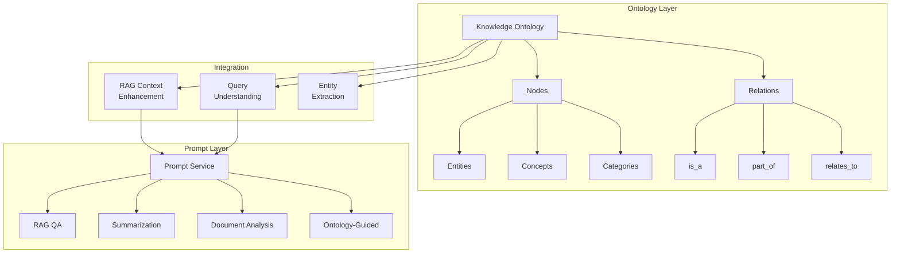
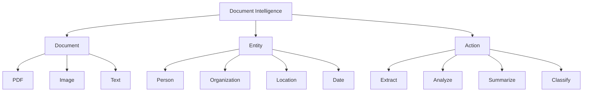
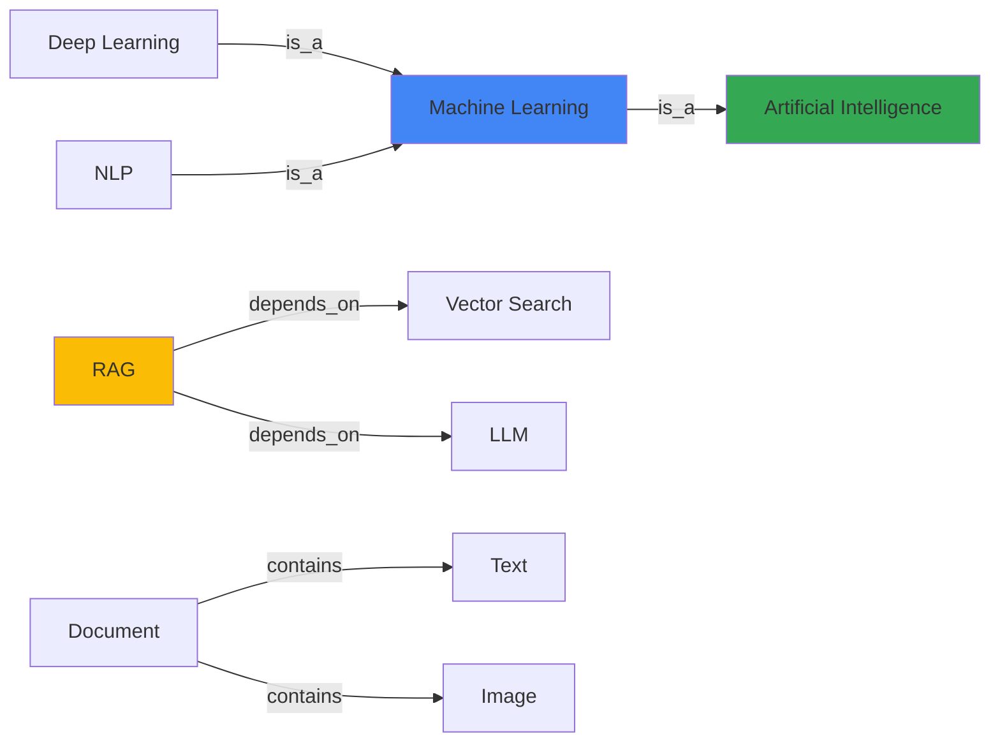

# Task 3: Prompt & Ontology Creation From Scratch

> **AI Developer Roadmap - Level 1**
> Establish a foundational semantic and conceptual model governing the system's reasoning, vocabulary, relationships, and interpretive structures.

## Overview

This module implements a knowledge ontology for document intelligence, defining domain-specific semantic structures, entity relationships, and conceptual hierarchies. It also extends the prompt service with ontology-aware prompts for enhanced RAG performance.

## Architecture



## Implementation

### Knowledge Ontology

#### [knowledge_ontology.py](file:///c:/Users/Aaron%20Sequeira/Roneira-AI-LLM-powered-document-intelligence-system/src/ontology/knowledge_ontology.py)

Domain ontology for document intelligence:

```python
from src.ontology import KnowledgeOntology, NodeType, RelationType

# Initialize ontology with core concepts
ontology = KnowledgeOntology("document_intelligence")

# Add domain-specific entities
ai_concept = ontology.add_concept(
    name="Artificial Intelligence",
    description="Simulation of human intelligence by machines",
    parent_name="technology",
)

ml_concept = ontology.add_concept(
    name="Machine Learning",
    description="Subset of AI enabling systems to learn from data",
    parent_name="technology",
)

# Define relationships
ontology.add_relation(
    source_id=ml_concept.node_id,
    target_id=ai_concept.node_id,
    relation_type=RelationType.IS_A,
    confidence=1.0,
)

# Find related concepts
related = ontology.find_related_concepts("Machine Learning", depth=2)

# Generate context for RAG
context = ontology.get_context_for_concept("Machine Learning")
```

### Ontology Structure

The system defines a hierarchical ontology with the following core concepts:



## Node Types

| Type | Description | Example |
|------|-------------|---------|
| **Entity** | Named real-world objects | Person, Organization, Location |
| **Concept** | Abstract ideas | Machine Learning, RAG, Embedding |
| **Category** | Grouping classifications | Document Types, Actions |
| **Attribute** | Properties of entities | Size, Date, Author |
| **Action** | Operations/processes | Extract, Analyze, Search |

## Relationship Types

| Relation | Description | Example |
|----------|-------------|---------|
| **is_a** | Inheritance/classification | "PDF is_a Document" |
| **part_of** | Composition | "Chapter part_of Book" |
| **relates_to** | General association | "Query relates_to Context" |
| **contains** | Containment | "Document contains Text" |
| **depends_on** | Dependency | "Retrieval depends_on Embedding" |

## Prompt Templates

### Enhanced Prompt Service

The prompt service includes ontology-aware templates:

```python
from backend.services.prompt_service import PromptService, PromptTemplate

prompt_service = PromptService()

# Register ontology-guided template
ontology_template = PromptTemplate(
    name="ontology_guided",
    template="""Use the following ontology context and retrieved documents to answer.

Ontology Context:
{ontology_context}

Document Context:
{context}

Question: {question}

Provide an answer that leverages both the semantic relationships 
in the ontology and the factual content from the documents.

Answer:""",
    description="Ontology-enhanced question answering",
)

prompt_service.register_template(ontology_template)

# Build ontology-guided prompt
prompt = prompt_service.build_prompt(
    "ontology_guided",
    ontology_context=ontology.get_context_for_concept("Document Processing"),
    context="Retrieved document content...",
    question="How does OCR work in document processing?"
)
```

### Standard Templates

| Template | Purpose |
|----------|---------|
| `rag_qa` | Standard RAG question answering |
| `rag_summarize` | Document summarization |
| `document_analysis` | Comprehensive document analysis |
| `ontology_guided` | Ontology-enhanced reasoning |
| `entity_extraction` | Named entity extraction |

## RAG Integration

The ontology enhances RAG in several ways:

### 1. Query Expansion
```python
# Expand query with related concepts
related = ontology.find_related_concepts(query_term, depth=1)
expanded_query = query + " " + " ".join(r.name for r in related)
```

### 2. Context Enrichment
```python
# Add semantic context to retrieved documents
for entity in extracted_entities:
    context = ontology.get_context_for_concept(entity)
    enriched_context += context
```

### 3. Answer Validation
```python
# Validate answer against ontology constraints
if "Machine Learning" in answer:
    assert ontology.find_path("Machine Learning", "AI") is not None
```

## Visualization

### Ontology Graph



## Export Formats

### JSON Export
```json
{
  "name": "document_intelligence",
  "statistics": {
    "total_nodes": 25,
    "total_relations": 42,
    "max_depth": 4
  },
  "nodes": [
    {
      "node_id": "ml_a1b2c3d4",
      "name": "Machine Learning",
      "node_type": "concept",
      "description": "Subset of AI enabling systems to learn"
    }
  ],
  "relations": [
    {
      "source_id": "ml_a1b2c3d4",
      "target_id": "ai_e5f6g7h8",
      "relation_type": "is_a",
      "confidence": 1.0
    }
  ]
}
```

### RDF/Turtle Export
```turtle
@prefix : <http://example.org/document_intelligence#> .
@prefix rdfs: <http://www.w3.org/2000/01/rdf-schema#> .

:Machine_Learning a owl:Class ;
    rdfs:label "Machine Learning" ;
    rdfs:comment "Subset of AI enabling systems to learn" .

:Machine_Learning :isa :Artificial_Intelligence .
```

## Screenshots

> **Note**: Screenshots will be captured after running the demo script.

### Screenshot 1: Ontology Graph Visualization
*[Placeholder for ontology graph]*

### Screenshot 2: Concept Hierarchy
*[Placeholder for hierarchy tree]*

### Screenshot 3: Prompt Template Library
*[Placeholder for prompt templates UI]*

## Key Takeaways

1. **Semantic Structure**: Ontology provides formal semantic definitions
2. **Relationship Modeling**: Multiple relationship types capture domain knowledge
3. **RAG Enhancement**: Ontology context improves retrieval and generation
4. **Export Flexibility**: JSON and RDF export for interoperability
5. **Prompt Integration**: Ontology-aware prompts for better reasoning

## References

- [OWL Web Ontology Language](https://www.w3.org/OWL/)
- [Knowledge Graph Best Practices](https://arxiv.org/abs/2003.02320)
- [Prompt Engineering Guide](https://www.promptingguide.ai/)
