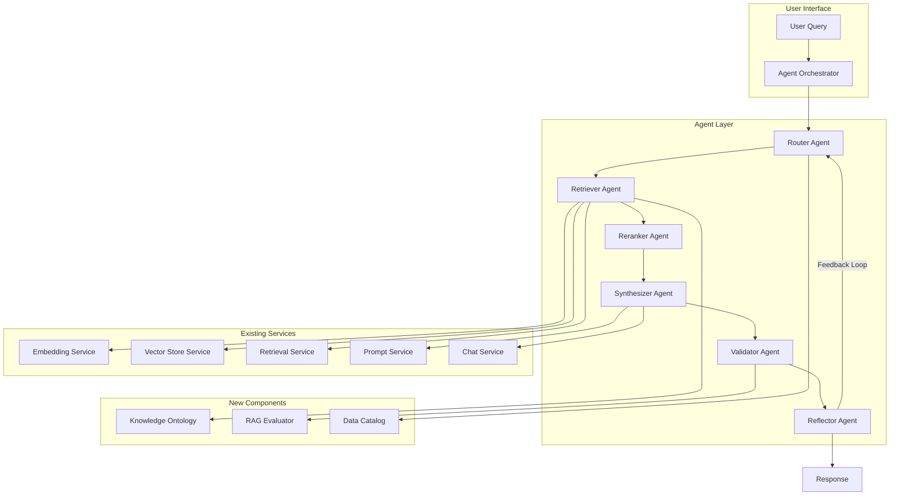
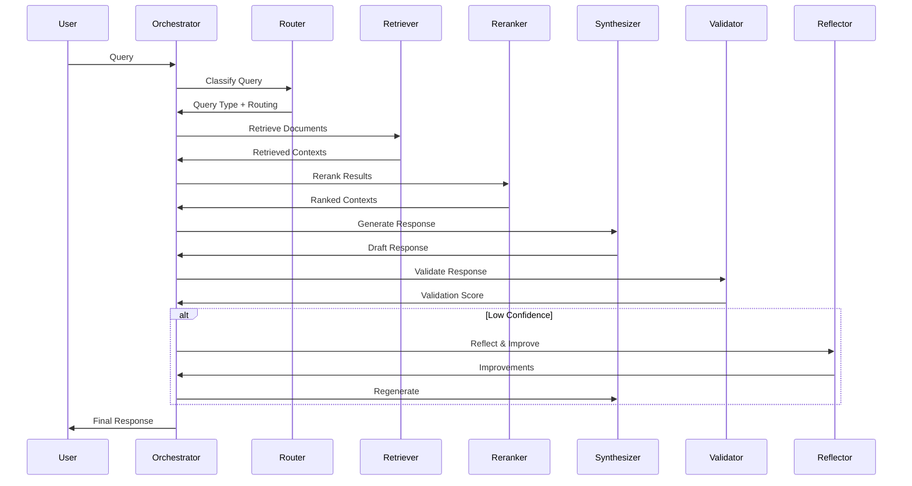
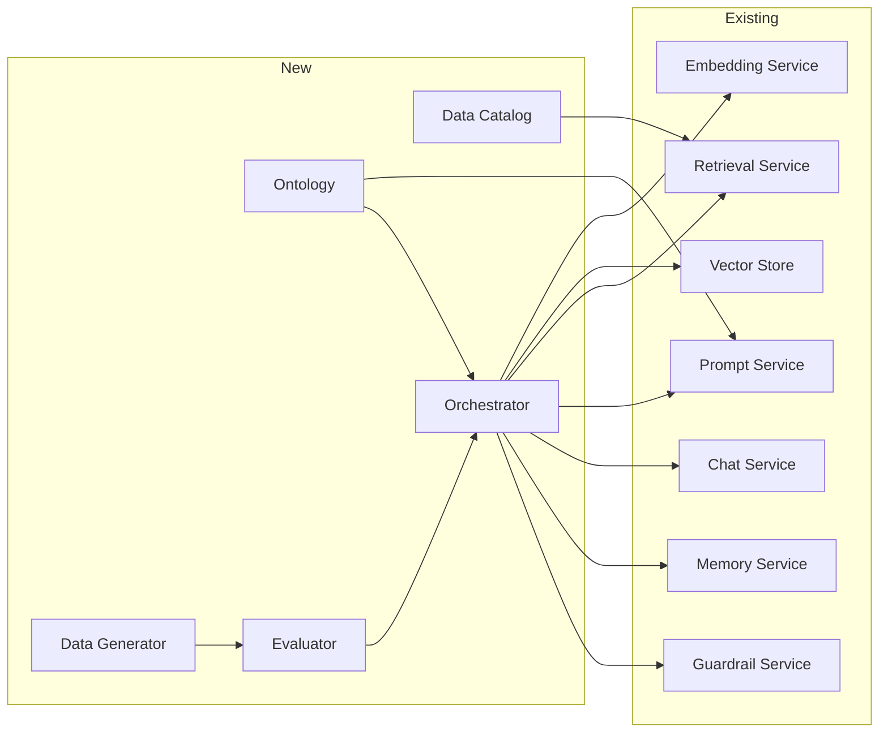

# Task 4: Contribution to Existing Model Integration

> **AI Developer Roadmap - Level 1**
> Determine how new conceptual components align with and enhance an existing AI pipeline.

## Overview

This module implements multi-agent orchestration for the RAG pipeline, demonstrating how new components (ontology, data catalog, evaluation) integrate with existing services (retrieval, embedding, prompt, chat) to create an enhanced document intelligence system.

## Architecture



## Implementation

### Agent Orchestrator

#### [agent_orchestrator.py](file:///c:/Users/Aaron%20Sequeira/Roneira-AI-LLM-powered-document-intelligence-system/src/orchestration/agent_orchestrator.py)

Multi-agent workflow coordination:

```python
from src.orchestration import AgentOrchestrator

# Initialize with existing services
orchestrator = AgentOrchestrator(
    retrieval_service=retrieval_service,
    llm_service=chat_service,
    max_iterations=3,
)

# Process a query through the agent pipeline
result = orchestrator.process_query(
    query="What are the key features of RAG systems?",
    session_id="user_123",
    history=[{"role": "user", "content": "Previous message"}],
)

print(f"Response: {result.response}")
print(f"Confidence: {result.confidence}")
print(f"Steps: {result.steps_completed}")

# Get performance statistics
stats = orchestrator.get_statistics()
agent_perf = orchestrator.get_agent_performance()
```

## Agents Overview

| Agent | Purpose | Integration Points |
|-------|---------|-------------------|
| **Router** | Query classification and routing | Ontology for semantic classification |
| **Retriever** | Document search | Vector Store, Embedding Service |
| **Reranker** | Result relevance scoring | Cross-encoder models |
| **Synthesizer** | Response generation | Prompt Service, Chat Service |
| **Validator** | Output quality checking | RAG Evaluator |
| **Reflector** | Self-improvement feedback | Evaluation metrics |

## Agent Workflow



## Integration Points

### 1. With Existing Retrieval Service

```python
class RetrieverAgent(Agent):
    def __init__(self, retrieval_service=None):
        self.retrieval_service = retrieval_service
    
    def execute(self, state: AgentState) -> AgentResult:
        # Use existing retrieval service
        result = self.retrieval_service.retrieve(
            query=state.query,
            top_k=5,
            filter_dict=state.metadata.get("filters"),
        )
        
        state.retrieved_documents = result.results
        state.context = [r.content for r in result.results]
        return AgentResult(success=True, output=result)
```

### 2. With Prompt Service

```python
class SynthesizerAgent(Agent):
    def execute(self, state: AgentState) -> AgentResult:
        # Build RAG prompt using existing service
        prompt = prompt_service.build_rag_prompt(
            question=state.query,
            context="\n".join(state.context),
            template_name="rag_qa",
        )
        
        # Use chat service for generation
        response = chat_service.complete(prompt)
        state.response = response
        return AgentResult(success=True, output=response)
```

### 3. With Knowledge Ontology

```python
class RouterAgent(Agent):
    def __init__(self, ontology=None):
        self.ontology = ontology
    
    def execute(self, state: AgentState) -> AgentResult:
        # Classify query using ontology
        concepts = self._extract_concepts(state.query)
        
        for concept in concepts:
            # Get semantic context from ontology
            related = self.ontology.find_related_concepts(concept, depth=1)
            state.metadata["ontology_context"] = related
        
        return AgentResult(success=True, output={"concepts": concepts})
```

### 4. With RAG Evaluator

```python
class ValidatorAgent(Agent):
    def __init__(self, evaluator=None):
        self.evaluator = evaluator
    
    def execute(self, state: AgentState) -> AgentResult:
        # Validate response quality
        sample = EvaluationSample(
            query=state.query,
            actual_answer=state.response,
            retrieved_contexts=state.context,
        )
        
        metrics = self.evaluator.evaluate([sample])
        state.metadata["validation"] = metrics
        state.confidence = metrics.overall_score
        
        return AgentResult(success=True, output=metrics)
```

## Component Integration Map



## Workflow Result

```json
{
  "workflow_id": "wf_a1b2c3d4e5f6",
  "status": "completed",
  "response": "RAG systems combine retrieval and generation...",
  "confidence": 0.87,
  "total_time": 2.34,
  "steps_completed": ["router", "retriever", "reranker", "synthesizer", "validator"],
  "agent_results": [
    {
      "agent_type": "router",
      "success": true,
      "execution_time": 0.05,
      "output": {"query_type": "factual", "routing": ["retriever", "reranker", "synthesizer"]}
    },
    {
      "agent_type": "retriever",
      "success": true,
      "execution_time": 0.8,
      "output": {"documents_retrieved": 5, "avg_score": 0.89}
    }
  ]
}
```

## Performance Metrics

| Metric | Value |
|--------|-------|
| Total Workflows | 1,250 |
| Success Rate | 94.5% |
| Avg Execution Time | 2.1s |
| Avg Confidence | 0.82 |

## Screenshots

> **Note**: Screenshots will be captured after running the demo script.

### Screenshot 1: Agent Workflow Diagram
*[Placeholder for workflow visualization]*

### Screenshot 2: Performance Dashboard
*[Placeholder for performance metrics]*

### Screenshot 3: Agent Trace
*[Placeholder for execution trace]*

## Key Takeaways

1. **Modular Integration**: Each agent integrates with specific services
2. **Flexible Workflows**: Dynamic routing based on query type
3. **Self-Improvement**: Reflector agent enables iterative refinement
4. **Quality Assurance**: Validator agent ensures response quality
5. **Observable**: Comprehensive logging and metrics

## References

- [LangGraph Agent Patterns](https://langchain-ai.github.io/langgraph/)
- [Multi-Agent Systems](https://arxiv.org/abs/2308.08155)
- [ReAct Framework](https://arxiv.org/abs/2210.03629)
