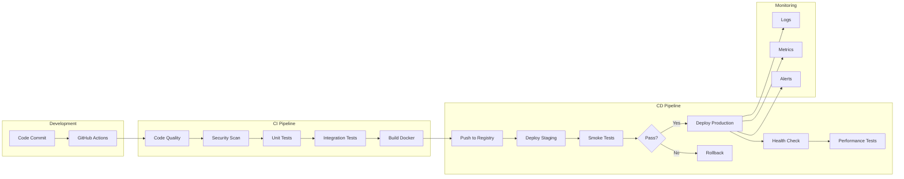
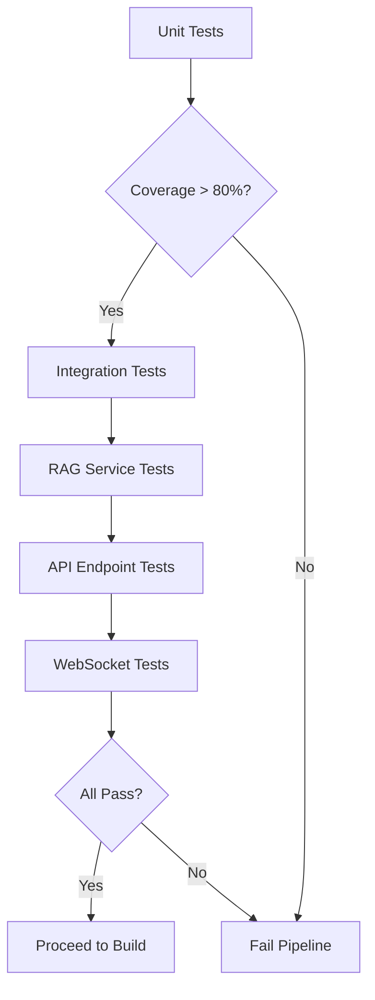
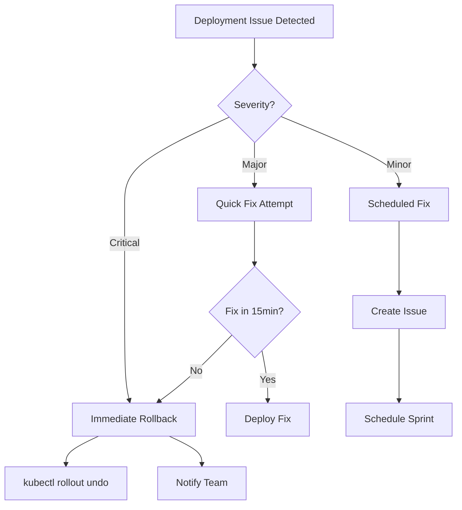
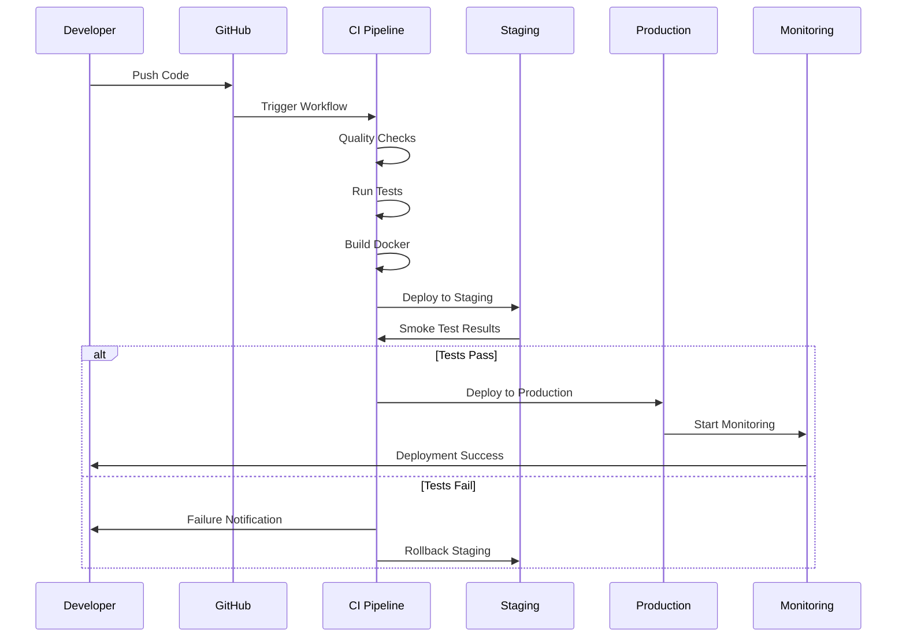

# Task 5: Deployment via Existing Pipeline

> **AI Developer Roadmap - Level 1**
> Define a conceptual deployment that transitions updated system components through established environments in a controlled and observable manner.

## Overview

This task documents the existing CI/CD pipeline for the Roneira Document Intelligence System, demonstrating how code changes flow from development through staging to production with proper validation at each stage.

## Architecture



## CI/CD Pipeline

### [ci-cd.yml](file:///c:/Users/Aaron%20Sequeira/Roneira-AI-LLM-powered-document-intelligence-system/.github/workflows/ci-cd.yml)

The existing pipeline includes comprehensive stages:

```yaml
name: CI/CD Pipeline

on:
  push:
    branches: [main, develop]
  pull_request:
    branches: [main]

jobs:
  code-quality:
    runs-on: ubuntu-latest
    steps:
      - name: Black formatting
      - name: isort imports
      - name: Flake8 linting
      - name: MyPy type checking
      - name: Bandit security
      - name: Safety dependency check

  test:
    runs-on: ubuntu-latest
    services:
      redis:
        image: redis:7-alpine
      postgres:
        image: postgres:15-alpine
    steps:
      - name: Run unit tests
      - name: Run integration tests
      - name: Upload coverage

  build:
    runs-on: ubuntu-latest
    steps:
      - name: Build Docker image
      - name: Push to Docker Hub

  deploy-staging:
    runs-on: ubuntu-latest
    environment: staging
    steps:
      - name: Deploy to Railway
      - name: Run smoke tests

  deploy-production:
    runs-on: ubuntu-latest
    environment: production
    steps:
      - name: Deploy to production
      - name: Health check
      - name: Performance tests (K6)
```

## Deployment Stages

### Stage 1: Code Quality & Security

| Check | Tool | Purpose |
|-------|------|---------|
| Formatting | Black | Consistent code style |
| Imports | isort | Import organization |
| Linting | Flake8 | Code quality |
| Types | MyPy | Static type checking |
| Security | Bandit | Vulnerability detection |
| Dependencies | Safety | Dependency vulnerabilities |

### Stage 2: Testing



### Stage 3: Build & Push

```yaml
- name: Build and push Docker image
  uses: docker/build-push-action@v4
  with:
    context: .
    push: true
    tags: |
      ${{ secrets.DOCKER_USERNAME }}/roneira-doc-intel:${{ github.sha }}
      ${{ secrets.DOCKER_USERNAME }}/roneira-doc-intel:latest
    cache-from: type=gha
    cache-to: type=gha,mode=max
```

### Stage 4: Staging Deployment

**Platform**: Railway

```toml
# railway.toml
[build]
builder = "dockerfile"

[deploy]
healthcheckPath = "/health"
healthcheckTimeout = 300
restartPolicyType = "ALWAYS"
numReplicas = 1

[environments.staging]
variables = { DEBUG = "true", LOG_LEVEL = "DEBUG" }
```

### Stage 5: Production Deployment

**Platform**: Render / Vercel

```yaml
# render.yaml
services:
  - type: web
    name: roneira-doc-intel
    env: python
    buildCommand: pip install -r requirements.txt
    startCommand: uvicorn backend.main:app --host 0.0.0.0 --port $PORT
    healthCheckPath: /health
    autoDeploy: true
    envVars:
      - key: ENVIRONMENT
        value: production
```

## Validation Checkpoints

### Pre-Deployment Validation

```python
# scripts/deployment_validator.py
class DeploymentValidator:
    def validate_staging(self, endpoint: str) -> bool:
        """Validate staging deployment."""
        checks = [
            self._check_health(endpoint),
            self._check_api_version(endpoint),
            self._check_database_connection(endpoint),
            self._check_redis_connection(endpoint),
        ]
        return all(checks)
    
    def check_rollback_readiness(self) -> bool:
        """Ensure rollback is possible."""
        return (
            self._previous_version_available() and
            self._database_migrations_reversible() and
            self._feature_flags_configured()
        )
```

### Post-Deployment Validation

| Check | Endpoint | Expected |
|-------|----------|----------|
| Health | `/health` | `200 OK` |
| Readiness | `/health/ready` | `200 OK` |
| API Version | `/api/v1/version` | Current version |
| Document Upload | `/api/v1/upload` | Accept file |
| RAG Chat | `/api/v1/chat` | Response in < 3s |

## Rollback Procedures



### Rollback Commands

```bash
# Railway rollback
railway rollback --to-deployment=<previous-id>

# Docker rollback
docker pull roneira/doc-intel:previous
docker-compose up -d

# Kubernetes rollback
kubectl rollout undo deployment/roneira-doc-intel
```

## Monitoring & Observability

### Health Endpoints

```python
@app.get("/health")
async def health_check():
    return {"status": "healthy", "timestamp": datetime.now().isoformat()}

@app.get("/health/ready")
async def readiness_check():
    # Check all dependencies
    redis_ok = await check_redis()
    db_ok = await check_database()
    
    if redis_ok and db_ok:
        return {"status": "ready"}
    raise HTTPException(500, "Not ready")
```

### Metrics Collection

| Metric | Type | Description |
|--------|------|-------------|
| `request_latency` | Histogram | Request response times |
| `request_count` | Counter | Total requests |
| `error_rate` | Gauge | Error percentage |
| `active_sessions` | Gauge | Active user sessions |
| `document_processed` | Counter | Documents processed |

### Alerting Rules

```yaml
alerts:
  - name: HighErrorRate
    condition: error_rate > 0.05
    severity: critical
    action: page_oncall
    
  - name: HighLatency
    condition: p95_latency > 3s
    severity: warning
    action: slack_notification
    
  - name: ServiceDown
    condition: health_check_failed
    severity: critical
    action: immediate_rollback
```

## Deployment Flow Diagram



## Environment Configuration

| Environment | Purpose | URL |
|-------------|---------|-----|
| Development | Local testing | `localhost:8000` |
| Staging | Pre-production | `staging.roneira.app` |
| Production | Live system | `api.roneira.app` |

## Screenshots

> **Note**: Screenshots will be captured from GitHub Actions workflow runs.

### Screenshot 1: CI/CD Pipeline Dashboard
*[Placeholder for GitHub Actions workflow visualization]*

### Screenshot 2: Deployment Logs
*[Placeholder for deployment logs screenshot]*

### Screenshot 3: Health Check Dashboard
*[Placeholder for monitoring dashboard]*

### Screenshot 4: Performance Metrics
*[Placeholder for K6 performance test results]*

## Key Takeaways

1. **Automated Pipeline**: Fully automated from commit to production
2. **Quality Gates**: Multiple validation checkpoints
3. **Safe Rollback**: Easy rollback procedures
4. **Observability**: Comprehensive monitoring and alerting
5. **Multi-Platform**: Supports Railway, Render, and Vercel

## References

- [GitHub Actions Documentation](https://docs.github.com/en/actions)
- [Railway Deployment Guide](https://docs.railway.app/)
- [Render Deployment](https://render.com/docs)
- [K6 Performance Testing](https://k6.io/docs/)
