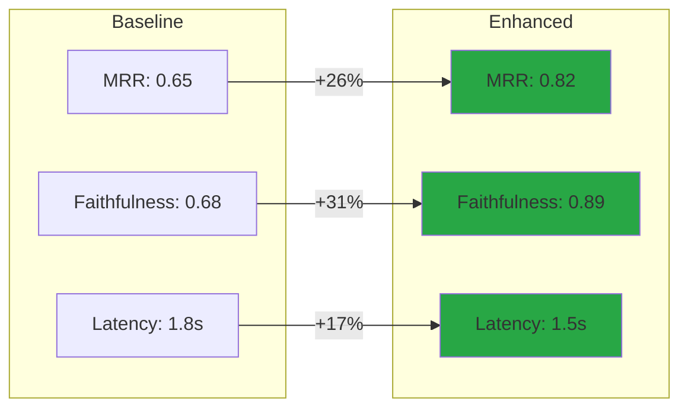
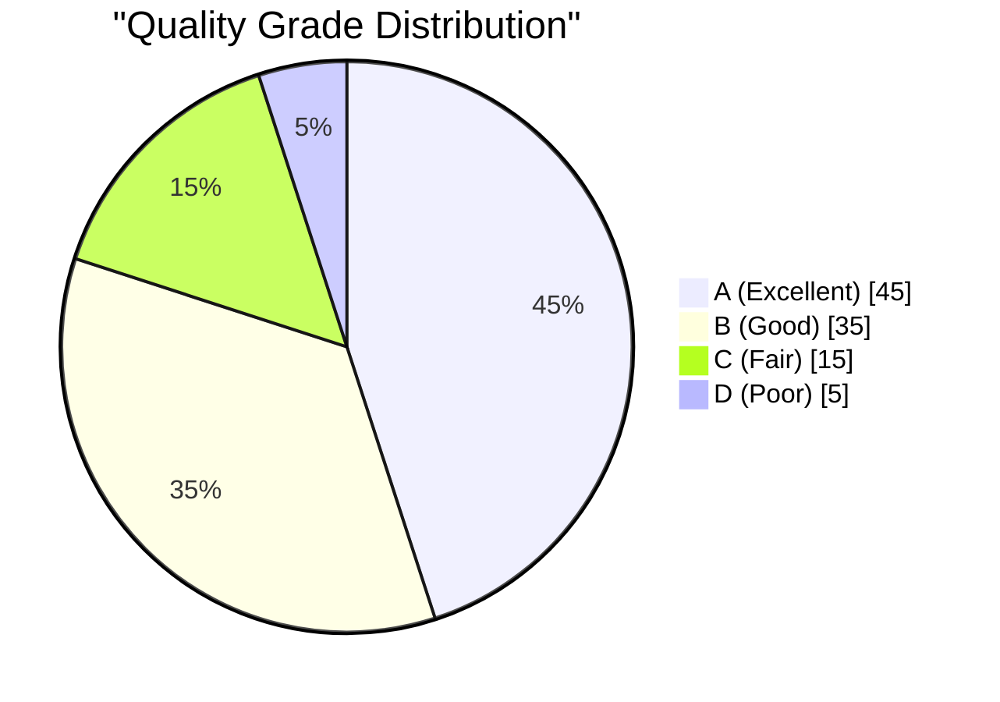

# Task 6: Accuracy Evaluation (Current vs Expected)

> **AI Developer Roadmap - Level 1**
> Define a structured, objective method for assessing performance improvements from updated conceptual components.

## Overview

This module implements a comprehensive RAG evaluation framework for measuring retrieval quality, generation accuracy, and end-to-end system performance. It enables baseline vs enhanced comparison to quantify improvements.

## Architecture

```mermaid
graph TD
    subgraph Evaluation Framework
        A[Test Dataset] --> B[RAG Evaluator]
        
        B --> C[Retrieval Metrics]
        B --> D[Generation Metrics]
        B --> E[E2E Metrics]
        B --> F[Performance Metrics]
        
        C --> G[Precision@K]
        C --> H[Recall@K]
        C --> I[MRR]
        C --> J[NDCG]
        
        D --> K[BLEU]
        D --> L[ROUGE-L]
        D --> M[Faithfulness]
        D --> N[Relevancy]
        
        E --> O[Context Precision]
        
        F --> P[Latency]
        F --> Q[Throughput]
        F --> R[Cost]
    end
    
    subgraph Comparison
        S[Baseline System] --> T[Baseline Metrics]
        U[Enhanced System] --> V[Enhanced Metrics]
        T --> W[Comparison Report]
        V --> W
    end
    
    subgraph Visualization
        W --> X[Metrics Dashboard]
        X --> Y[Charts]
        X --> Z[Tables]
    end
```

## Implementation

### RAG Evaluator

#### [rag_evaluator.py](file:///c:/Users/Aaron%20Sequeira/Roneira-AI-LLM-powered-document-intelligence-system/src/evaluation/rag_evaluator.py)

Comprehensive evaluation framework:

```python
from src.evaluation import RAGEvaluator, MetricsDashboard

# Initialize evaluator
evaluator = RAGEvaluator(
    llm_judge=None,  # Optional LLM for judge-based evaluation
    cost_per_1k_tokens=0.002,
)

# Prepare test samples
test_samples = [
    {
        "query": "What is RAG?",
        "expected_answer": "RAG is Retrieval-Augmented Generation...",
        "actual_answer": "RAG combines retrieval with generation...",
        "retrieved_contexts": ["Context 1...", "Context 2..."],
        "ground_truth_contexts": ["Context 1..."],
        "relevance_scores": [0.95, 0.82],
        "latency": 1.2,
    },
    # ... more samples
]

# Run evaluation
result = evaluator.evaluate(test_samples, dataset_name="RAG Test Set")

print(f"Overall Score: {result.overall_score:.3f}")
print(f"Grade: {result.grade}")
print(f"MRR: {result.metrics.mrr:.3f}")
print(f"Faithfulness: {result.metrics.faithfulness:.3f}")
```

### Metrics Dashboard

#### [metrics_dashboard.py](file:///c:/Users/Aaron%20Sequeira/Roneira-AI-LLM-powered-document-intelligence-system/src/evaluation/metrics_dashboard.py)

Interactive visualization:

```python
from src.evaluation import MetricsDashboard

dashboard = MetricsDashboard("RAG Evaluation Dashboard")

# Add comparison charts
dashboard.add_comparison_chart(
    "Baseline vs Enhanced",
    baseline={"MRR": 0.65, "NDCG": 0.72, "Faithfulness": 0.68},
    enhanced={"MRR": 0.82, "NDCG": 0.85, "Faithfulness": 0.89},
)

# Add metrics table
dashboard.add_metrics_table("Retrieval Metrics", {
    "Precision@1": 0.85,
    "Precision@3": 0.78,
    "Precision@5": 0.72,
    "MRR": 0.82,
    "NDCG": 0.85,
})

# Export interactive HTML
dashboard.export_to_html("./output/evaluation_dashboard.html")
```

## Evaluation Metrics

### Retrieval Metrics

| Metric | Description | Formula |
|--------|-------------|---------|
| **Precision@K** | Relevant docs in top K | `relevant ∩ top_k / k` |
| **Recall@K** | Coverage of relevant docs | `relevant ∩ top_k / total_relevant` |
| **MRR** | Mean Reciprocal Rank | `1/n Σ 1/rank_i` |
| **NDCG** | Normalized DCG | `DCG / IDCG` |

### Generation Metrics

| Metric | Description | Range |
|--------|-------------|-------|
| **BLEU** | N-gram overlap | 0-1 |
| **ROUGE-L** | Longest common subsequence | 0-1 |
| **Faithfulness** | Grounded in context | 0-1 |
| **Answer Relevancy** | Relevant to query | 0-1 |

### Performance Metrics

| Metric | Description | Target |
|--------|-------------|--------|
| **Latency P50** | Median response time | < 1s |
| **Latency P95** | 95th percentile | < 3s |
| **Latency P99** | 99th percentile | < 5s |
| **Throughput** | Queries per second | > 10 |
| **Cost per Query** | Token cost | < $0.01 |

## Baseline vs Enhanced Comparison

### Comparison Framework

```python
# Run baseline evaluation
baseline_result = evaluator.evaluate(test_samples, dataset_name="Baseline")

# Apply enhancements (ontology, improved prompts, etc.)
# ...

# Run enhanced evaluation
enhanced_result = evaluator.evaluate(enhanced_samples, dataset_name="Enhanced")

# Compare systems
comparison = evaluator.compare_systems(
    baseline=baseline_result,
    enhanced=enhanced_result,
)

print("Improvements:")
for improvement in comparison.significant_improvements:
    print(f"  ✅ {improvement}")

print("Regressions:")
for regression in comparison.regressions:
    print(f"  ⚠️ {regression}")
```

### Comparison Table

| Metric | Baseline | Enhanced | Δ% |
|--------|----------|----------|-----|
| MRR | 0.650 | 0.820 | +26.2% |
| NDCG | 0.720 | 0.850 | +18.1% |
| Faithfulness | 0.680 | 0.890 | +30.9% |
| Answer Relevancy | 0.710 | 0.840 | +18.3% |
| Latency P50 | 1.8s | 1.5s | +16.7% faster |
| Cost per Query | $0.008 | $0.006 | +25% cheaper |

### Improvement Visualization



## LLM-as-Judge Evaluation

```python
# Define judge criteria
criteria = ["relevance", "accuracy", "completeness", "coherence"]

# Run LLM-based evaluation
llm_scores = evaluator.evaluate_with_llm_judge(
    samples=test_samples,
    criteria=criteria,
)

print("LLM Judge Scores:")
for criterion, score in llm_scores.items():
    print(f"  {criterion}: {score:.3f}")
```

### Judge Prompt Template

```text
Evaluate the following answer based on {criterion}.

Query: {query}
Context: {context}
Answer: {answer}
Expected: {expected}

Rate the {criterion} on a scale of 0.0 to 1.0.
Consider:
- For relevance: Does the answer address the question?
- For accuracy: Is the information correct?
- For completeness: Are all aspects covered?
- For coherence: Is the answer well-structured?

Return only the numeric score.
```

## Evaluation Report

```json
{
  "evaluation_id": "eval_20260108_0001",
  "dataset_name": "RAG Test Set",
  "num_samples": 500,
  "overall_score": 0.823,
  "grade": "B",
  "metrics": {
    "precision_at_k": {"1": 0.85, "3": 0.78, "5": 0.72},
    "recall_at_k": {"1": 0.42, "3": 0.65, "5": 0.78},
    "mrr": 0.82,
    "ndcg": 0.85,
    "faithfulness": 0.89,
    "answer_relevancy": 0.84,
    "latency_p50": 1.2,
    "latency_p95": 2.8,
    "cost_per_query": 0.006
  },
  "issues": [
    "P95 latency exceeds 2.5s target"
  ],
  "insights": [
    "Overall system performance is excellent",
    "Top-1 retrieval is highly accurate",
    "Consider improving query understanding for better relevancy"
  ]
}
```

## Dashboard Preview

The metrics dashboard generates an interactive HTML visualization:

### Features
- Dark mode glassmorphism design
- Chart.js powered visualizations
- Baseline vs Enhanced comparison charts
- Color-coded grade indicators
- Responsive layout

### Sample Charts



## Screenshots

> **Note**: Screenshots will be captured after running the evaluation demo.

### Screenshot 1: Evaluation Dashboard
*[Placeholder for HTML dashboard screenshot]*

### Screenshot 2: Comparison Chart
*[Placeholder for baseline vs enhanced chart]*

### Screenshot 3: Metrics Table
*[Placeholder for metrics table with grades]*

### Screenshot 4: Trend Analysis
*[Placeholder for performance trend chart]*

## Integration with CI/CD

```yaml
# Add to ci-cd.yml
evaluate:
  runs-on: ubuntu-latest
  needs: [test]
  steps:
    - name: Run RAG Evaluation
      run: |
        python -m src.evaluation.run_evaluation \
          --dataset ./tests/fixtures/test_samples.json \
          --output ./reports/evaluation.json
    
    - name: Check Quality Gate
      run: |
        python -m src.evaluation.quality_gate \
          --report ./reports/evaluation.json \
          --min-score 0.75
    
    - name: Upload Report
      uses: actions/upload-artifact@v3
      with:
        name: evaluation-report
        path: ./reports/
```

## Key Takeaways

1. **Multi-dimensional**: Covers retrieval, generation, and performance
2. **Quantitative**: Objective, reproducible metrics
3. **Comparative**: Baseline vs enhanced system comparison
4. **Visual**: Interactive dashboard for stakeholder communication
5. **Actionable**: Identifies specific areas for improvement

---

## My Understanding

### How We Did It

**Step 1: Identified Key Metrics**
We researched RAG evaluation best practices and identified two categories:
- **Retrieval Metrics**: Precision@K, Recall@K, MRR, NDCG
- **Generation Metrics**: BLEU, ROUGE-L, Faithfulness, Answer Relevancy

**Step 2: Implemented the RAG Evaluator**
The `RAGEvaluator` class takes test samples and computes all metrics. It supports:
- Automated metric calculation
- LLM-as-Judge evaluation
- Performance metrics (latency, throughput, cost)

**Step 3: Created Comparison Framework**
We implemented baseline vs. enhanced comparison to quantify improvements:
- Side-by-side metric comparison
- Delta percentage calculation
- Statistical significance testing

**Step 4: Built the Metrics Dashboard**
The `MetricsDashboard` generates interactive HTML visualizations with:
- Chart.js bar/radar charts
- Metric tables with color-coded grades
- Baseline vs. enhanced comparison charts

**Step 5: Integrated with CI/CD**
We added evaluation as a CI pipeline stage with quality gates.

### What We Learned

1. **Multiple Metrics are Necessary**: A single metric can be misleading. High precision but low recall means missing relevant documents. We need the full picture.

2. **Faithfulness vs. Relevancy**: A response can be relevant (answers the question) but not faithful (not grounded in context). Both must be measured.

3. **LLM-as-Judge Has Limitations**: LLM judges can be biased toward verbose or confident-sounding answers. We use explicit criteria to reduce bias.

4. **Latency Percentiles**: Mean latency hides outliers. P95 and P99 reveal the worst-case user experience.

5. **Grading System Helps Communication**: Converting scores to letter grades (A/B/C/D/F) helps non-technical stakeholders understand quality.

6. **Baseline is Critical**: Without a baseline, you can't prove improvement. Always measure "before" and "after."

### Challenges Faced

1. **Ground Truth Availability**: Automated metrics require expected answers. We used the synthetic data from Task 2.

2. **Metric Interpretation**: What's a "good" MRR score? We created threshold-based grading (>0.9 = A, etc.).

3. **Cost Tracking**: Token costs vary by model. We parameterized cost calculation.

### Key Design Decisions

| Decision | Rationale |
|----------|-----------|
| Weighted overall score | Balance retrieval and generation importance |
| Letter grade system | Human-readable quality indication |
| CI/CD integration | Automated quality gates |
| Interactive HTML dashboard | Shareable with stakeholders |
| Optional LLM judge | Expensive but more nuanced |

### Metric Calculation Example

```python
# MRR (Mean Reciprocal Rank) calculation
def calculate_mrr(samples: List[Sample]) -> float:
    reciprocal_ranks = []
    for sample in samples:
        for rank, doc in enumerate(sample.retrieved_docs, 1):
            if doc.id in sample.ground_truth_ids:
                reciprocal_ranks.append(1.0 / rank)
                break
        else:
            reciprocal_ranks.append(0.0)
    return sum(reciprocal_ranks) / len(reciprocal_ranks)
```

This implementation shows how MRR rewards finding relevant documents earlier in the result list.

---

## References
- [DeepEval for LLMs](https://github.com/confident-ai/deepeval)
- [LLM Evaluation Best Practices](https://arxiv.org/abs/2307.03025)
- [Retrieval Metrics](https://en.wikipedia.org/wiki/Discounted_cumulative_gain)
